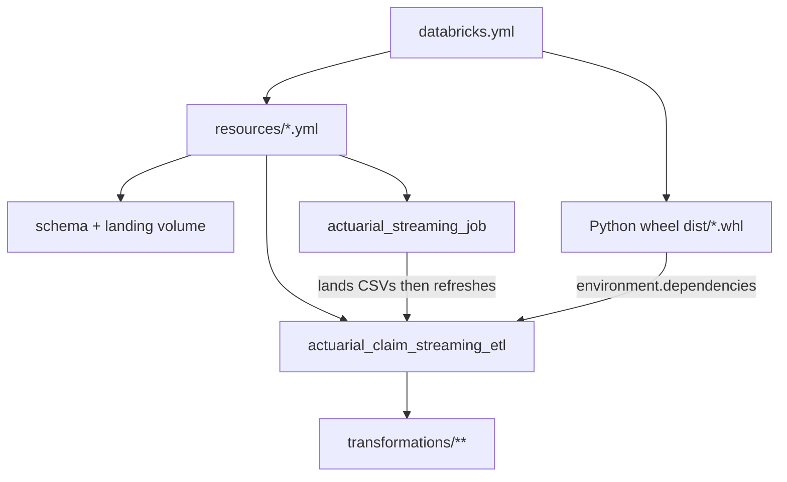
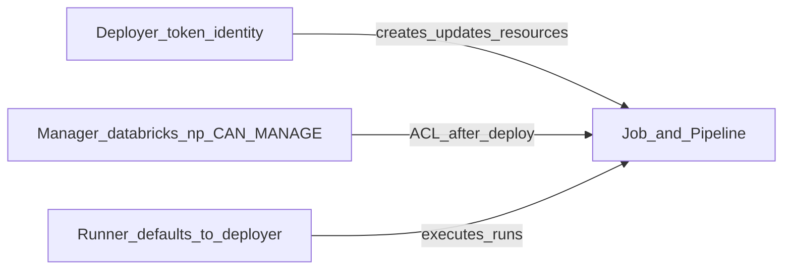
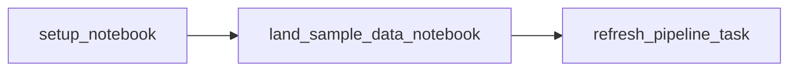
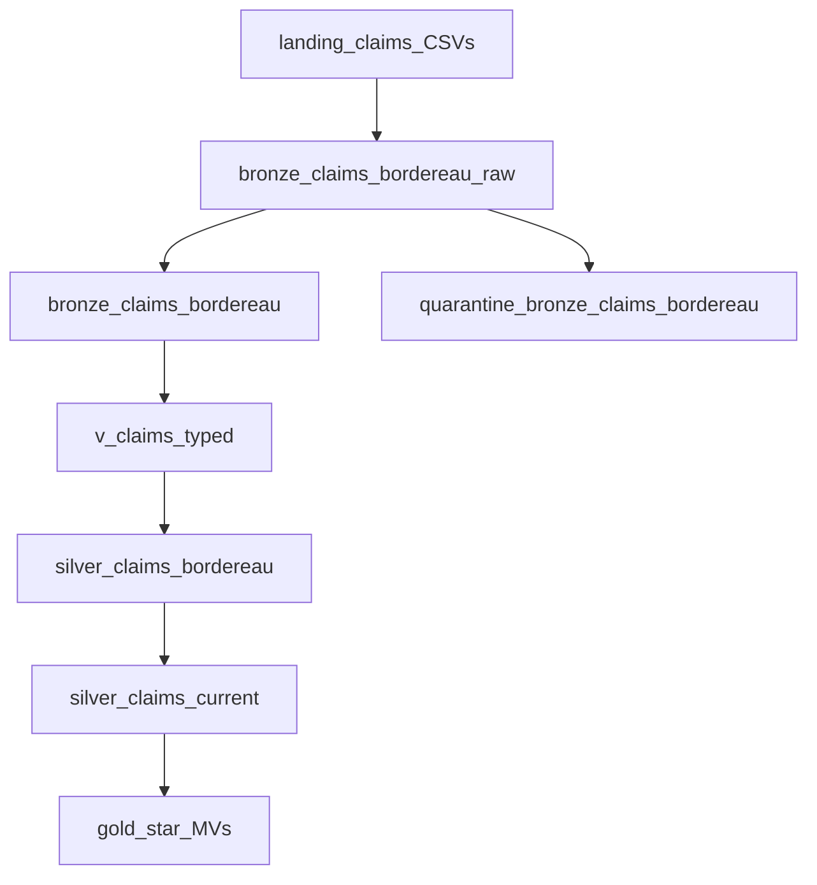
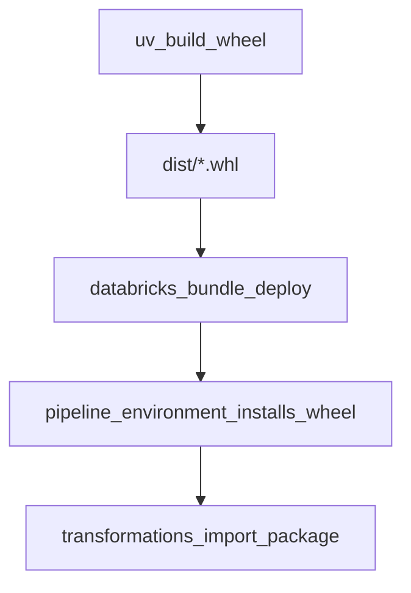
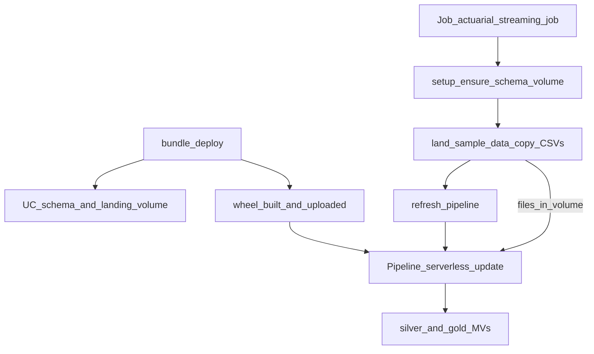

# Bundle Concepts Training Guide

**Project:** `actuarial_claim_streaming_pipeline`  
**Audience:** Engineers learning how this Declarative Automation Bundle (DAB) is structured and how data flows from fixtures to gold marts  
**Style:** Trainer-led walkthrough — read in order, pause at each checkpoint

---

## 0. Welcome and learning path

### What you are learning

This project is a Databricks Asset Bundle that demonstrates a full actuarial **streaming medallion** on Unity Catalog using a serverless **Lakeflow Declarative Pipeline**. It showcases all three Lakeflow dataset types:

| Type | Persist to UC? | In this project |
|------|----------------|-----------------|
| **Streaming Table** | Yes | Bronze raw / clean / quarantine (Auto Loader) |
| **Temporary view** | No | `v_claims_typed`, `v_premiums_typed` |
| **Materialized View** | Yes | Silver cleanses + gold actuarial marts |

By the end of this guide you will be able to open any YAML or Python file in the bundle and explain **what it deploys**, **who can manage it**, **where data moves**, and **how to run** the demo end to end.

### Suggested reading order

1. Big picture (this section + §1)
2. [`databricks.yml`](../databricks.yml) — bundle contract
3. Permissions (`CAN_MANAGE`) — prod ownership
4. Schema + landing volume — Unity Catalog containers
5. The Job — orchestration
6. Notebooks — `01_setup` + `land_sample_data`
7. The Pipeline YAML — deployment contract
8. Claims path deep dive — raw → clean → quarantine → typed → silver → gold
9. Python wheel — shared library packaging
10. Putting it all together
11. Execution steps — validate, deploy, run, verify, incremental demo, CI
12. Glossary + self-check

### Map of key files

| File | Role |
|------|------|
| [`databricks.yml`](../databricks.yml) | Bundle identity, variables, targets, wheel build |
| [`resources/streaming.schema.yml`](../resources/streaming.schema.yml) | UC schema `actuarial.streaming` |
| [`resources/landing.volume.yml`](../resources/landing.volume.yml) | UC Volume `landing` |
| [`resources/actuarial_streaming_job.job.yml`](../resources/actuarial_streaming_job.job.yml) | Job: setup → land → refresh |
| [`resources/actuarial_claim_streaming_etl.pipeline.yml`](../resources/actuarial_claim_streaming_etl.pipeline.yml) | Lakeflow pipeline definition |
| [`src/notebooks/01_setup.ipynb`](../src/notebooks/01_setup.ipynb) | Create schema + volume (idempotent) |
| [`src/notebooks/land_sample_data.ipynb`](../src/notebooks/land_sample_data.ipynb) | Copy fixtures into landing volume |
| [`bronze_claims_bordereau_raw.py`](../src/actuarial_claim_streaming_etl/transformations/bronze_claims_bordereau_raw.py) | Auto Loader raw ingest |
| [`bronze_claims_bordereau.py`](../src/actuarial_claim_streaming_etl/transformations/bronze_claims_bordereau.py) | Clean bronze (key gate) |
| [`quarantine_bronze_claims_bordereau.py`](../src/actuarial_claim_streaming_etl/transformations/quarantine_bronze_claims_bordereau.py) | Bad-row audit sink |
| [`v_claims_typed.py`](../src/actuarial_claim_streaming_etl/transformations/v_claims_typed.py) | Temporary typed view |
| [`silver_claims_bordereau.py`](../src/actuarial_claim_streaming_etl/transformations/silver_claims_bordereau.py) | Quality-gated silver MV |
| [`silver_claims_current.py`](../src/actuarial_claim_streaming_etl/transformations/silver_claims_current.py) | Latest snapshot per claim |
| [`src/actuarial_claim_streaming_pipeline/`](../src/actuarial_claim_streaming_pipeline/) | Shared Python package (built as a wheel) |
| [`.github/workflows/actuarial-claim-streaming-pipeline.yml`](../../.github/workflows/actuarial-claim-streaming-pipeline.yml) | CI: test → validate → deploy prod → run → smoke |

**Checkpoint:** This guide is the full walkthrough (concepts + labs). The main [README](../README.md) remains the short operational reference.

---

## 1. Big picture first

Before diving into YAML fields, lock the mental model: **`databricks.yml` orchestrates; `resources/*.yml` are the deployable assets; the Job lands files; the Pipeline transforms them.**

### Bundle wiring



### End-to-end data architecture

```text
fixtures/sample-data/ (claims batches + dims)
        │
        ▼
 Job: actuarial_streaming_job
   setup → land_sample_data → refresh_pipeline
        │
        ▼
 /Volumes/actuarial/streaming/landing/{claims,premiums,risk_zones,cyclone_events}/
        │
        ▼
 Pipeline: actuarial_claim_streaming_etl
        │
        ├── bronze_*_raw          (Streaming Table, Auto Loader)
        ├── bronze_*              (Streaming Table, clean)
        ├── quarantine_bronze_*   (Streaming Table, bad rows)
        ├── v_claims_typed        (Temporary view)
        ├── v_premiums_typed      (Temporary view)
        ├── silver_*              (Materialized View)
        └── gold_*                (Materialized View)
```

### Quick facts

| Item | Value |
|------|--------|
| Catalog / schema | `actuarial.streaming` |
| Landing volume | `/Volumes/actuarial/streaming/landing` |
| Pipeline | `actuarial_claim_streaming_etl` (serverless, triggered) |
| Job | `actuarial_streaming_job` (`setup` → `land_sample_data` → `refresh_pipeline`) |

**Checkpoint:** If you can narrate “fixtures → Job → Volume → Pipeline → bronze/silver/gold,” you are ready for `databricks.yml`.

---

## 2. Lesson: `databricks.yml`

### Lesson goal

Explain every top-level section of the bundle root config and how targets change deploy behavior.

### What you are looking at

[`databricks.yml`](../databricks.yml) is the **entry point** for the Declarative Automation Bundle. When you run `databricks bundle deploy` or `databricks bundle run`, the CLI reads this file first, then pulls in everything under `resources/`.

It does **not** define SQL/Python transforms. It defines **what gets deployed**, **where**, and **with which variables**.

### Section by section

#### 2.1 `bundle` — identity

```yaml
bundle:
  name: actuarial_claim_streaming_pipeline
  uuid: 6cbe270f-796b-4c86-bab2-75c08f55a05a
```

- **`name`**: logical bundle name (used in workspace paths, CI, etc.)
- **`uuid`**: stable ID so Databricks can track this bundle across deploys

#### 2.2 `include` — pull in resource definitions

```yaml
include:
  - resources/*.yml
```

This loads all YAML under `resources/`. Those files define the actual Databricks objects:

| File | What it creates |
|------|-----------------|
| `streaming.schema.yml` | UC schema `actuarial.streaming` |
| `landing.volume.yml` | UC Volume `landing` for CSVs |
| `actuarial_claim_streaming_etl.pipeline.yml` | Lakeflow pipeline (bronze→silver→gold) |
| `actuarial_streaming_job.job.yml` | Job: setup → land data → refresh pipeline |

So `databricks.yml` is the **orchestrator**; `resources/*.yml` are the **deployable assets**.

```text
databricks.yml
    │
    ├── variables (catalog, cluster, landing path)
    ├── builds wheel (uv)
    └── includes resources/*.yml
            │
            ├── schema + volume  → actuarial.streaming + landing
            ├── pipeline         → Auto Loader bronze → silver/gold MVs
            └── job              → setup → land CSVs → refresh pipeline
```

#### 2.3 `artifacts` — build the Python wheel

```yaml
artifacts:
  python_artifact:
    type: whl
    build: uv build --wheel
```

On deploy, the CLI runs `uv build --wheel`, producing a `.whl` in `dist/`. The pipeline then installs that wheel (see `environment.dependencies: dist/*.whl` in the pipeline YAML). That package holds shared helpers under `src/actuarial_claim_streaming_pipeline/`.

We go deep on this in [§9](#9-lesson-python-wheel-dependency).

#### 2.4 `variables` — shared knobs

```yaml
variables:
  catalog:
    description: Unity Catalog catalog for streaming bronze tables
  cluster_id:
    description: Existing all-purpose cluster ID for land/setup notebook tasks
  landing_volume_path:
    description: UC Volume path where sample CSVs are landed for Auto Loader
```

These are **declared** here and **filled in per target**. Resources reference them as `${var.catalog}`, `${var.cluster_id}`, `${var.landing_volume_path}`.

#### 2.5 `targets` — environments

Two targets: **`dev`** (default) and **`prod`**.

**Common to both today:**

- Same workspace host: `https://adb-7405611775215693.13.azuredatabricks.net`
- Same variable values:
  - `catalog: actuarial`
  - `cluster_id: 0730-111218-jwuz715u` (all-purpose cluster for notebooks)
  - `landing_volume_path: /Volumes/actuarial/streaming/landing`

**`dev` specifics:**

- `mode: development` → resources get a `[dev <user>]` prefix; job schedules/triggers are paused (safe for iteration)
- `default: true` → used when you don’t pass `-t`
- `artifacts_dynamic_version: true` → wheel version bumps automatically so redeploys pick up code changes

**`prod` specifics:**

- `mode: production` → no dev prefix; schedules can run
- Explicit `root_path` under a fixed user workspace folder
- `permissions`: `databricks-np@...` gets `CAN_MANAGE` (next lesson)

**Checkpoint:** `databricks.yml` is the bundle contract (name, build, variables, targets). The data flow lives in included resources + Python under `src/`.

---

## 3. Lesson: Permissions deep dive (`CAN_MANAGE`)

### Lesson goal

Explain what this block does — and equally important, what it does **not** do.

### What you are looking at

```yaml
# Only under targets.prod
permissions:
  - user_name: databricks-np@saurabhuptut.onmicrosoft.com
    level: CAN_MANAGE
```

This is a **prod-only ACL grant** on the bundle’s deployed workspace resources — not Unity Catalog data access, and not “who can deploy.”

It sits next to:

```yaml
prod:
  mode: production
  workspace:
    root_path: /Workspace/Users/databricks-np@saurabhuptut.onmicrosoft.com/.bundle/${bundle.name}/${bundle.target}
```

### Why production mode wants this

With `mode: production`, Databricks validates that **`permissions`** (and preferably **`run_as`**) are declared so it is explicit who can manage/run deployed assets.

Without that clarity, prod deploy is treated as incomplete / unsafe for CI/CD-style ownership.

This project sets `permissions`, but **does not set `run_as`**. So:

| Concern | Who / what |
|--------|------------|
| ACL after deploy | `databricks-np` gets `CAN_MANAGE` on resources |
| Identity that *runs* jobs/pipelines | Whoever deployed (token identity), unless overridden |
| Where files live | That user’s home: `/Workspace/Users/databricks-np@.../.bundle/...` |

### What `CAN_MANAGE` actually grants

This is a **target-level** `permissions` block. Databricks applies it to **supported resources defined in the bundle**.

For this project, that mainly means:

| Resource | Effect of top-level `CAN_MANAGE` |
|----------|----------------------------------|
| Job `actuarial_streaming_job` | Edit definition, change schedule, manage permissions, delete, run |
| Pipeline `actuarial_claim_streaming_etl` | Edit settings, start/stop/refresh, manage permissions, delete |

Top-level allowed levels are only:

- `CAN_VIEW` — see / inspect
- `CAN_RUN` — trigger runs
- `CAN_MANAGE` — full control of the resource ACL surface

So `CAN_MANAGE` is the highest of those three: not “run only,” but **own/admin-level control of the job + pipeline objects**.

It does **not** automatically mean:

- UC `GRANT` on `actuarial.streaming` tables/volumes
- Ability to create catalogs
- Ability to use the all-purpose cluster (`cluster_id`) unless that user already has cluster ACL
- Permission to push to GitHub / use the PAT in CI

Those are separate systems.

### How it interacts with `root_path`

Prod deploys into:

```text
/Workspace/Users/databricks-np@saurabhuptut.onmicrosoft.com/.bundle/actuarial_claim_streaming_pipeline/prod
```

That choice is intentional: **one shared prod copy**, not one under every engineer’s home folder.

So `databricks-np` is playing two roles:

1. **Workspace folder owner** for the deployed bundle tree (notebooks, wheel artifacts, state)
2. **ACL principal** with `CAN_MANAGE` on the Job + Pipeline objects created from YAML

Folder ACLs and resource ACLs are related but not identical. Putting both under the same user keeps prod ownership coherent.

### Deploy identity vs manage identity vs run identity

CI (`.github/workflows/actuarial-claim-streaming-pipeline.yml`) uses:

```text
DATABRICKS_HOST / DATABRICKS_TOKEN
databricks bundle deploy --target prod
databricks bundle run actuarial_streaming_job --target prod
```

Three identities can diverge:



| Identity | Source in this project |
|----------|------------------------|
| **Deployer** | Whoever owns `DATABRICKS_TOKEN` (PAT / SP) |
| **Manager** | `databricks-np` via `permissions: CAN_MANAGE` |
| **Runner** | Deployer (no `run_as`) when jobs/pipelines execute |

If the token **is** `databricks-np`, all three line up — which is likely the intent of this lab/demo setup.

If the token were a different user or service principal:

- Deploy still works if that identity can write `root_path` and create jobs/pipelines
- `databricks-np` would still get `CAN_MANAGE` after deploy
- Runs would execute as the deployer unless you add `run_as`

Databricks generally recommends production with a **service principal** + `run_as` + `permissions`. This bundle uses a **user principal** instead — fine for a personal/non-prod workspace, less ideal for real prod multi-team ownership.

### Permissions order of precedence

If permissions are defined in multiple places:

1. Permissions defined for the resource in the target deployment
2. Permissions defined for the target deployment ← **this is what you have**
3. Permissions defined for the resource in the bundle
4. Permissions defined in the bundle’s top-level permissions

Also: the same principal must **not** be listed in both top-level and resource-level permissions (overlap is rejected). This project only uses target-level, so no conflict today.

### What it does *not* cover in the medallion flow

Even with `CAN_MANAGE` on the job/pipeline, the data plane still needs separate rights, for example:

- Create/use schema `actuarial.streaming`
- Read/write Volume `/Volumes/actuarial/streaming/landing`
- Write Streaming Tables / Materialized Views
- Attach to cluster `0730-111218-jwuz715u` for setup/land notebooks

Those come from UC grants / cluster ACLs for the **run identity**, not from this YAML block.

**Checkpoint (one sentence):** On every `databricks bundle deploy -t prod`, Databricks ensures user `databricks-np@...` has **full manage ACL** on the deployed streaming job and Lakeflow pipeline, aligned with the prod home-folder `root_path` that owns the single production copy of the bundle.

---

## 4. Lesson: Schema and landing volume

### Lesson goal

Explain the two Unity Catalog containers the streaming pipeline needs: a schema and a managed volume for raw CSV files.

### What you are looking at

These files declare **infrastructure only** — no transforms.

#### 4.1 `streaming.schema.yml` — create the UC schema

```yaml
resources:
  schemas:
    actuarial_streaming:
      catalog_name: ${var.catalog}
      name: streaming
      comment: Actuarial streaming bronze (Auto Loader Streaming Tables) and landing volume.
```

| Field | Value | Meaning |
|-------|--------|---------|
| Resource key | `actuarial_streaming` | Logical name inside the bundle (not the UC name) |
| `catalog_name` | `${var.catalog}` → `actuarial` | Parent catalog from `databricks.yml` |
| `name` | `streaming` | Real UC schema name |
| `comment` | docstring in Catalog Explorer | Human description |

**Result after deploy:** `actuarial.streaming`

That schema is the home for:

- the landing volume
- bronze Streaming Tables
- silver/gold Materialized Views created by the Lakeflow pipeline

#### 4.2 `landing.volume.yml` — create the UC Volume

```yaml
resources:
  volumes:
    actuarial_streaming_landing:
      catalog_name: ${var.catalog}
      schema_name: streaming
      name: landing
      volume_type: MANAGED
      comment: Landing zone for streaming bronze CSVs (Auto Loader).
```

| Field | Value | Meaning |
|-------|--------|---------|
| Resource key | `actuarial_streaming_landing` | Bundle ID for this volume |
| `catalog_name` | `actuarial` | Same catalog |
| `schema_name` | `streaming` | Must match the schema above |
| `name` | `landing` | UC volume name |
| `volume_type` | `MANAGED` | Databricks stores the files; you don’t bring your own ADLS path |

**Result after deploy:** `/Volumes/actuarial/streaming/landing`

That path is exactly what `databricks.yml` sets as `landing_volume_path`, and what Auto Loader reads from.

### How they fit together

```text
Catalog: actuarial
└── Schema: streaming          ← streaming.schema.yml
    ├── Volume: landing        ← landing.volume.yml
    │     /Volumes/actuarial/streaming/landing/
    │       ├── claims/
    │       ├── premiums/
    │       ├── risk_zones/
    │       └── cyclone_events/
    ├── bronze_* / quarantine_*  (Streaming Tables from pipeline)
    └── silver_* / gold_*        (Materialized Views from pipeline)
```

Order matters conceptually: **schema first, then volume** (volume lives inside the schema). Bundle deploy creates both as declared resources.

### Role in the data flow

1. **Deploy** creates `actuarial.streaming` + volume `landing`
2. **Job task `setup`** also runs `CREATE SCHEMA IF NOT EXISTS` / `CREATE VOLUME IF NOT EXISTS` (idempotent safety net in `01_setup.ipynb` — see [§6](#6-lesson-notebooks-deep-dive))
3. **Job task `land_sample_data`** copies `fixtures/sample-data/*` into the volume
4. **Pipeline** reads those paths via Auto Loader (`landing_path` config → `read_landing_csv`)

So these YAML files are the **declarative, IaC version** of “ensure the landing zone exists.” The notebooks reinforce the same objects at job runtime.

### `MANAGED` volume vs external

`volume_type: MANAGED` means:

- Files are stored in Databricks-managed storage under the metastore
- Path is always `/Volumes/<catalog>/<schema>/<volume>/...`
- Good for this demo (sample CSVs, no customer ADLS wiring)

An **external** volume would point at your own cloud storage URL; this project doesn’t do that.

### Bundle resource key vs UC name

| In YAML | In Unity Catalog |
|---------|------------------|
| `schemas.actuarial_streaming` | schema named `streaming` |
| `volumes.actuarial_streaming_landing` | volume named `landing` |

The left side is only for the bundle (references, deploy state). The right side is what you see in Catalog Explorer and in `/Volumes/...` paths.

**Checkpoint:** `streaming.schema.yml` creates the namespace `actuarial.streaming`; `landing.volume.yml` creates the file drop zone `/Volumes/actuarial/streaming/landing` where CSVs land before Auto Loader bronze ingest.

---

## 5. Lesson: The Job

### Lesson goal

Explain how `actuarial_streaming_job` orchestrates setup, landing, and pipeline refresh — without doing the transforms itself.

### What you are looking at

[`resources/actuarial_streaming_job.job.yml`](../resources/actuarial_streaming_job.job.yml)

```yaml
resources:
  jobs:
    actuarial_streaming_job:
      name: actuarial_streaming_job
```

On deploy, Databricks gets a Job named `actuarial_streaming_job`. The bundle key and display name match.

### Schedule

```yaml
trigger:
  periodic:
    interval: 1
    unit: DAYS
```

Configured to run **once per day**. In **`dev`** (`mode: development`), schedules/triggers are **paused** automatically. In **`prod`**, this trigger is active unless you pause it in the UI.

### Job parameters

| Parameter | Default | Role |
|-----------|---------|------|
| `catalog` | `actuarial` | UC catalog |
| `schema` | `streaming` | UC schema |
| `landing_path` | `/Volumes/actuarial/streaming/landing` | Where CSVs are written |
| `source_path` | bundle `fixtures/sample-data` in workspace (`${workspace.file_path}/...`) | Where sample CSVs are read from |
| `claims_batch` | `"01"` | Which claims file(s) to land (`01` / `02` / `03` / `all`) |

`{{job.parameters.*}}` passes these into notebook widgets at run time. You can override them when triggering a run (useful for the incremental claims demo: land `02`, then `03`).

### Task graph

```text
setup  →  land_sample_data  →  refresh_pipeline
```



#### 1. `setup`

- Runs on the **all-purpose cluster** from `databricks.yml` (`cluster_id`)
- Notebook: [`01_setup.ipynb`](../src/notebooks/01_setup.ipynb) — details in [§6](#6-lesson-notebooks-deep-dive)
- Does: `CREATE SCHEMA IF NOT EXISTS` + `CREATE VOLUME IF NOT EXISTS`

#### 2. `land_sample_data`

- Same cluster
- Notebook: [`land_sample_data.ipynb`](../src/notebooks/land_sample_data.ipynb) — details in [§6](#6-lesson-notebooks-deep-dive)
- Copies fixtures into the volume (dims always; claims per `claims_batch`)

#### 3. `refresh_pipeline`

- Not a notebook — a **`pipeline_task`**
- Triggers Lakeflow pipeline `actuarial_claim_streaming_etl`
- `${resources.pipelines.actuarial_claim_streaming_etl.id}` is resolved at deploy time to the real pipeline ID

No `existing_cluster_id` here: the pipeline is **serverless**.

### Compute split

| Task | Compute | Why |
|------|---------|-----|
| `setup`, `land_sample_data` | All-purpose cluster | Need a cluster to run notebooks + filesystem copy into Volumes |
| `refresh_pipeline` | Serverless Lakeflow | Pipeline owns its own compute |

### Design choices worth noticing

1. **Job = orchestration; pipeline = transforms** — notebooks only prepare files and schema.
2. **`claims_batch` parameter** — lets you demo incremental ingest without changing code.
3. **`source_path` uses `${workspace.file_path}`** — points at fixtures synced into the workspace by bundle deploy, not your laptop.
4. **Idempotent setup** — safe to re-run; volume/schema already exist from DAB resources.

**Checkpoint:** This Job is the daily (or on-demand) wrapper that lands sample data into the UC Volume, then kicks the streaming medallion pipeline. Notebook internals are next.

---

## 6. Lesson: Notebooks deep dive

### Lesson goal

Explain what `01_setup.ipynb` and `land_sample_data.ipynb` do cell-by-cell, and why they exist alongside DAB schema/volume resources.

### Role in the Job

```text
Job: actuarial_streaming_job
  01_setup.ipynb          ← ensure schema + volume
       ↓
  land_sample_data.ipynb  ← copy fixtures into /Volumes/.../landing
       ↓
  refresh_pipeline        ← Lakeflow (not a notebook)
```

Both run on the all-purpose cluster (`existing_cluster_id`). They prepare the landing zone; they do **not** run Auto Loader or silver/gold transforms.

---

### 6.1 `01_setup.ipynb` — ensure containers exist

**Purpose:** Idempotent bootstrap of schema + volume.

| Widget | Default | From job |
|--------|---------|----------|
| `catalog` | `actuarial` | `{{job.parameters.catalog}}` |
| `schema` | `streaming` | `{{job.parameters.schema}}` |
| `volume_name` | `landing` | hard-coded `landing` in job YAML |

Builds path: `/Volumes/{catalog}/{schema}/{volume_name}`.

**What it runs:**

```sql
CREATE SCHEMA IF NOT EXISTS actuarial.streaming ...
CREATE VOLUME IF NOT EXISTS actuarial.streaming.landing ...
```

Safe to re-run; `IF NOT EXISTS` means no wipe of data.

**Why it exists alongside DAB YAML:** Bundle deploy already creates schema + volume from `streaming.schema.yml` / `landing.volume.yml`. This notebook is a **runtime safety net** if the Job runs before a fresh deploy, or if objects were dropped. Same end state, two paths.

---

### 6.2 `land_sample_data.ipynb` — put files where Auto Loader looks

**Purpose:** Copy sample CSVs from the **workspace** (bundle-synced fixtures) into the **UC Volume**. Auto Loader only watches the volume, not `fixtures/` in the repo.

| Widget | Default | Role |
|--------|---------|------|
| `catalog` | `actuarial` | `USE CATALOG` |
| `landing_path` | `/Volumes/actuarial/streaming/landing` | Destination root |
| `source_path` | job sets `${workspace.file_path}/fixtures/sample-data` | Source root |
| `claims_batch` | `"01"` | Which claims file(s) to land |

**Always copied (dimensions):**

| Source under fixtures | Dest under landing |
|----------------------|--------------------|
| `premiums/premium_bordereau.csv` | `.../landing/premiums/` |
| `risk_zones/risk_zone_lookup.csv` | `.../landing/risk_zones/` |
| `cyclone_events/cyclone_events.csv` | `.../landing/cyclone_events/` |

**Claims by `claims_batch`:**

| `claims_batch` | Files landed into `.../landing/claims/` |
|----------------|----------------------------------------|
| `01` | `claims_batch_01.csv` only |
| `02` | `claims_batch_02.csv` only |
| `03` | `claims_batch_03.csv` only |
| `all` | all three batch files |

**How copy works:** resolve `source_path` (with `/Workspace/...` fallback), then `shutil.copy2` each file into the matching volume subdir (`mkdir` as needed). Destination filename stays the same.

**Why claims are append-only:** Auto Loader tracks files already ingested by path. For the incremental demo:

- Run 1 with `claims_batch=01` → lands batch 01 → pipeline ingests it  
- Run 2 with `claims_batch=02` → lands **new** filename batch 02 → only that file is new  

Do **not** overwrite an already-ingested filename for this demo.

### Resulting volume layout

```text
/Volumes/actuarial/streaming/landing/
  claims/claims_batch_01.csv      (and maybe 02/03 later)
  premiums/premium_bordereau.csv
  risk_zones/risk_zone_lookup.csv
  cyclone_events/cyclone_events.csv
```

### Mental model

| Notebook | Role |
|----------|------|
| `01_setup` | Make sure the bucket (schema/volume) exists |
| `land_sample_data` | Drop today’s sample parcels into the bucket |
| Pipeline | Process whatever is new in the bucket |

**Checkpoint:** Notebooks prepare the landing zone only. Transforms live under `transformations/` and are covered next.

---

## 7. Lesson: The Pipeline YAML

### Lesson goal

Explain the Lakeflow Declarative Pipeline **deployment contract** — what the YAML configures, not every transform (claims path is [§8](#8-lesson-claims-path-deep-dive)).

### What you are looking at

[`resources/actuarial_claim_streaming_etl.pipeline.yml`](../resources/actuarial_claim_streaming_etl.pipeline.yml)

The Job only triggers this pipeline; this YAML says *what* the pipeline is and *where* its code lives.

### Core fields

```yaml
resources:
  pipelines:
    actuarial_claim_streaming_etl:
      name: actuarial_claim_streaming_etl
      catalog: ${var.catalog}
      schema: streaming
      serverless: true
      root_path: "../src/actuarial_claim_streaming_etl"
```

| Field | Value | Meaning |
|-------|--------|---------|
| Bundle key / `name` | `actuarial_claim_streaming_etl` | Pipeline name in Databricks |
| `catalog` | `actuarial` | UC catalog for published tables/views |
| `schema` | `streaming` | Objects land in `actuarial.streaming` |
| `serverless` | `true` | Lakeflow manages compute (no cluster_id) |
| `root_path` | `../src/actuarial_claim_streaming_etl` | Pipeline project root in the workspace |

Default run mode is **triggered** (batch-style update when the Job or you start it), not continuous streaming.

### Where the transform code comes from

```yaml
libraries:
  - glob:
      include: ../src/actuarial_claim_streaming_etl/transformations/**
```

Every Python file under `transformations/` is loaded as pipeline source. Decorators map to dataset types:

- `@dp.table(...)` → **Streaming Table** (bronze / quarantine)
- `@temporary_view(...)` → **temp view** (DAG only, not in UC)
- `@materialized_view(...)` → **Materialized View** (silver / gold)

Lakeflow builds the DAG from how those functions read each other’s tables/views.

### Configuration and wheel

```yaml
configuration:
  landing_path: ${var.landing_volume_path}

environment:
  dependencies:
    - dist/*.whl
```

- `landing_path` becomes Spark conf → Auto Loader reads `/Volumes/.../landing/{subdir}`
- Wheel install enables `import actuarial_claim_streaming_pipeline...` (details in [§9](#9-lesson-python-wheel-dependency))

### Dataset types (core concepts)

| Type | How records are handled | When to use |
|------|-------------------------|-------------|
| Streaming Table | Each input file/row processed once (append-oriented) | Ingest from cloud storage |
| Temporary view | Computed inside the pipeline; **not** a Catalog table | Intermediate typed logic without storage cost |
| Materialized View | Result kept up to date for the defining query | Silver cleanses, joins, gold marts |

**How to see temporary views:** open the pipeline in Databricks → graph / DAG. They will **not** appear under Catalog Explorer → `actuarial.streaming` as tables.

### Auto Loader reminders

- Bronze raw tables use `spark.readStream.format("cloudFiles")`.
- Lakeflow owns schema location and checkpoints — **do not** set `cloudFiles.schemaLocation` or checkpoint paths in code.
- Reset ingest state with a **FULL REFRESH**, not by deleting ad-hoc paths.

### What this file does *not* define

- Table-level transform logic — in `transformations/**` ([§8](#8-lesson-claims-path-deep-dive))
- Landing zone creation — schema/volume YAML + setup notebook
- Schedule — the Job’s daily trigger

You can also run the pipeline alone: `databricks bundle run actuarial_claim_streaming_etl`.

**Checkpoint:** Pipeline YAML is the deployment contract. Next lesson walks the claims lineage file by file.

---

## 8. Lesson: Claims path deep dive

### Lesson goal

Walk the claims lineage from landing CSVs through gold, and explain **why** each hop is a separate dataset.

### Claims lineage



```text
landing/claims/*.csv
        │
        ▼
bronze_claims_bordereau_raw     ← keep all ingested rows
        │
   ┌────┴────┐
   ▼         ▼
bronze_*   quarantine_*         ← clean path vs bad-row path
   │
   ▼
v_claims_typed                  ← typing only (temp view)
   │
   ▼
silver_claims_bordereau         ← quality + persist (MV)
   │
   ▼
silver_claims_current           ← latest snapshot per claim_id
   │
   ▼
gold_*                          ← actuarial marts
```

---

### 8.1 Raw — `bronze_claims_bordereau_raw.py`

**Purpose:** Auto Loader entry point from `/Volumes/.../landing/claims`.

- Reads new CSVs via `cloudFiles` + schema hints
- Adds `_ingest_ts` and `_source_file`
- Uses `@dp.expect` (warn/metrics) on `_rescued_data IS NULL` — does **not** drop bad rows
- Comment: **no row drops**; quarantine captures failures

This table is the append-only record of **what landed**, including rows that later fail quality checks.

---

### 8.2 Clean — `bronze_claims_bordereau.py`

**Purpose:** Quality-gated bronze that downstream can trust.

- Reads from the **raw** Streaming Table (not the landing volume again)
- `@dp.expect_or_drop` on `claim_id IS NOT NULL` → null keys **dropped** from this table
- Still expects `_rescued_data` null

Downstream (typed view → silver) reads **`bronze_claims_bordereau`**, not `_raw`.

**Why two files (raw + clean)?**

| Concern | One table only | Raw + clean (this project) |
|--------|----------------|----------------------------|
| Bad rows | Drop silently or pollute clean | Drop from clean **and** send to quarantine |
| Audit | Hard to see what Auto Loader saw | Raw retains full ingest |
| Fan-out | Expectations mixed with ingest | Ingest once; clean + quarantine both read raw |

---

### 8.3 Quarantine — `quarantine_bronze_claims_bordereau.py`

**Purpose:** Audit sink for rows that fail bronze quality.

```python
return quarantine_from_raw(spark.readStream.table("bronze_claims_bordereau_raw"), "claim_id")
```

Keeps rows where `_rescued_data IS NOT NULL` **or** `claim_id IS NULL`, and stamps:

- **`quarantine_reason`** — e.g. `rescued_data`, `claim_id_null`, or both
- **`_quarantine_ts`** — when quarantined

Without quarantine, `@dp.expect_or_drop` would drop bad rows with little trace. Silver/gold do **not** read this table — it is for DQ / ops.

---

### 8.4 Typed temp view — `v_claims_typed.py`

**Purpose:** Pipeline-scoped typing before silver quality rules.

```python
@temporary_view(name="v_claims_typed")
def v_claims_typed():
    return transform_typed_claims(spark.read.table("bronze_claims_bordereau"))
```

`transform_typed_claims` only shapes columns (**no quality filters**):

- `try_cast` dates / decimals (bad values → null, not hard fail)
- Rename `_source_file` → `source_file_name`, `_ingest_ts` → `bronze_ingestion_timestamp`

| | Temp view `v_claims_typed` | Silver MV |
|--|---------------------------|-----------|
| In Catalog Explorer? | **No** | Yes |
| Stored as a table? | No | Yes |
| Role | Typing / reshape for the DAG | Durable, quality-gated contract |

See it in the **pipeline graph/DAG**, not under `SHOW TABLES`.

---

### 8.5 Silver bordereau — `silver_claims_bordereau.py`

**Purpose:** Typed, quality-filtered claim **snapshots** as a Materialized View.

```python
return apply_claims_quality(spark.read.table("v_claims_typed"))
```

**Two quality layers:**

1. **Python** (`apply_claims_quality`) — required fields, date order, amount sanity; adds `silver_ingestion_timestamp`
2. **Expectations** — `claim_id` / `policy_id` / `incurred_gte_paid` as `expect_or_drop`; `reported_on_or_after_loss` as softer `@dp.expect`

---

### 8.6 Silver current — `silver_claims_current.py`

**Purpose:** Latest claim snapshot per `claim_id` (window over `snapshot_date`).

Reads `silver_claims_bordereau` → `transform_silver_claims_current`. Gold marts typically join this “current” view, not every historical snapshot row.

---

### 8.7 Gold inventory

Gold Materialized Views read silver (not bronze). Inventory:

| Gold MV | Typical inputs | Role |
|---------|----------------|------|
| `gold_claims_summary` | `silver_claims_current` + `silver_premium_bordereau` | Frequency / severity / settlement by peril, status, risk dims |
| `gold_loss_ratio_by_risk` | premiums + claims | Loss ratio by risk band / region |
| `gold_event_loss_summary` | claims + cyclone events (+ premiums as needed) | Losses by cyclone event |
| `gold_portfolio_exposure` | premiums + risk zones | Portfolio exposure |
| `gold_claims_development` | claims + premiums | Claims development style mart |

Example wiring (`gold_claims_summary.py`):

```python
claims = spark.read.table("silver_claims_current")
premiums = spark.read.table("silver_premium_bordereau")
return build_gold_claims_summary(claims, premiums)
```

---

### 8.8 Same pattern elsewhere

The bronze **raw → clean → quarantine** pattern repeats for:

- premiums (`bronze_premium_bordereau_*`, `quarantine_bronze_premium_bordereau`)
- risk zones
- cyclone events

Premiums also have **`v_premiums_typed`** (temporary view) before silver, analogous to claims.

**Checkpoint:** You can name the file for each claims hop and say whether it is a Streaming Table, temp view, or Materialized View.

---

## 9. Lesson: Python wheel dependency

### Lesson goal

Explain why the pipeline needs a `.whl`, what is inside it, and how build + install work end to end.

### Why this exists

The wheel is how **shared business logic** gets into the serverless pipeline environment. Transform files alone are not enough — they `import` a separate Python package that must be installed at runtime.

### Two code trees, two delivery mechanisms

| Path | Role | How it reaches the pipeline |
|------|------|-----------------------------|
| `src/actuarial_claim_streaming_etl/transformations/**` | Thin dataset definitions (`@dp.table`, etc.) | `libraries.glob` — loaded as pipeline source |
| `src/actuarial_claim_streaming_pipeline/**` | Shared helpers (`auto_loader`, `silver`, `gold`, decorators) | Built as a **wheel**, installed via `environment.dependencies` |

Transforms look like this:

```python
from actuarial_claim_streaming_pipeline.auto_loader import read_landing_csv
from actuarial_claim_streaming_pipeline.pipeline_decorators import materialized_view
```

Those imports only work if package `actuarial_claim_streaming_pipeline` is on `sys.path`. The wheel does that. The glob does **not** install that package — it only registers the transformation modules as Lakeflow datasets.

### Build side (`databricks.yml`)

```yaml
artifacts:
  python_artifact:
    type: whl
    build: uv build --wheel
```

On `databricks bundle deploy`:

1. CLI runs `uv build --wheel` in the bundle root
2. Hatchling packs only `src/actuarial_claim_streaming_pipeline`
3. Output lands in `dist/*.whl`
4. Bundle uploads that artifact with the deployment

**What’s inside the wheel:**

```text
actuarial_claim_streaming_pipeline/
  __init__.py
  auto_loader.py           # Auto Loader + quarantine helpers
  silver.py                # typing / quality / silver transforms
  gold.py                  # gold mart builders
  pipeline_decorators.py   # temporary_view / materialized_view fallbacks
  main.py
```

**Not in the wheel:** `actuarial_claim_streaming_etl/`, notebooks, fixtures, tests.

### Consume side (pipeline YAML)

```yaml
environment:
  dependencies:
    - dist/*.whl
```

Editable installs are unreliable for serverless pipeline envs — ship a real `.whl`.

### Why not put helpers in `transformations/`?

1. **Unit-testable without Lakeflow** — pytest imports the package directly
2. **One package, many datasets** — ~20 transform files reuse the same helpers
3. **Serverless isolation** — workers need an installable artifact
4. **Runtime decorator compatibility** — `pipeline_decorators.py` abstracts API differences

### Empty `dependencies` in `pyproject.toml`

The wheel declares **no pip deps**. Spark / `pyspark.pipelines` come from the Databricks runtime. Extra pip packages belong under `environment.dependencies` next to `dist/*.whl`.

### Versioning and redeploys

On **dev**, `artifacts_dynamic_version: true` patches the wheel version at deploy time so serverless picks up new code without bumping `0.0.1` manually. **Prod** does not set that preset in this project.

### Wheel lifecycle



### Mental model

- **`libraries.glob`** = “these files *are* the pipeline graph”
- **`environment.dependencies: dist/*.whl`** = “install this library so those files can import shared code”

**Checkpoint:** Two trees, two delivery paths — glob for the DAG, wheel for the importable library.

---

## 10. Putting it all together

### One run, all pieces



### Narrative

1. **`databricks bundle deploy`**  
   Creates/updates schema, volume, job, pipeline; builds and uploads the wheel; syncs notebooks and fixtures to `root_path`.

2. **Job starts** (`bundle run` or schedule)  
   - `setup` widgets: `catalog`, `schema`, `volume_name=landing` → ensure UC containers  
   - `land_sample_data` widgets: `landing_path`, `source_path`, `claims_batch` (default `01`) → copy CSVs  
   - `refresh_pipeline` starts Lakeflow

3. **Pipeline update**  
   - Installs `dist/*.whl`  
   - Loads `transformations/**`  
   - Claims hop: raw → clean + quarantine → `v_claims_typed` → `silver_claims_bordereau` → `silver_claims_current` → gold  
   - Temporary views exist only inside the pipeline DAG

### File → responsibility (claims path)

| File | Dataset | Type |
|------|---------|------|
| `bronze_claims_bordereau_raw.py` | `bronze_claims_bordereau_raw` | Streaming Table |
| `bronze_claims_bordereau.py` | `bronze_claims_bordereau` | Streaming Table |
| `quarantine_bronze_claims_bordereau.py` | `quarantine_bronze_claims_bordereau` | Streaming Table |
| `v_claims_typed.py` | `v_claims_typed` | Temporary view |
| `silver_claims_bordereau.py` | `silver_claims_bordereau` | Materialized View |
| `silver_claims_current.py` | `silver_claims_current` | Materialized View |
| `gold_*.py` | `gold_*` | Materialized View |

### Where to look in the UI

| What you want | Where |
|---------------|--------|
| Tables and volume | Catalog Explorer → `actuarial` → `streaming` |
| Temporary views (`v_claims_typed`, …) | Pipeline graph / DAG — **not** Catalog Explorer |
| Job task history | Workflows → `actuarial_streaming_job` |
| Pipeline update details | Pipelines → `actuarial_claim_streaming_etl` |
| Deployed notebooks / wheel artifacts | Workspace → `root_path` under `.bundle/...` |

### Contrast with the batch project

| | Batch job (`actuarial_claim_pipeline`) | This streaming pipeline |
|--|--|--|
| Bronze | Full overwrite each run | Auto Loader appends **new files only** |
| Intermediate logic | Notebook cells / Python modules | Temporary views in the pipeline DAG |
| Silver / gold | Managed Delta overwrite | Materialized Views refreshed by the pipeline |
| Bad rows | Filtered away silently | Quarantine Streaming Tables |

**Checkpoint:** You can walk from `databricks.yml` to a gold mart and name the file for each hop. Hands-on steps are next.

---

## 11. Execution steps (lab)

### Lesson goal

Run the bundle yourself: local checks → deploy → first job → verify → incremental batch → optional CI.

### 11.1 Prerequisites

- Databricks CLI authenticated to the workspace in `databricks.yml`
- Catalog `actuarial` grants for schemas, volumes, tables, streaming tables, and materialized views
- All-purpose cluster `0730-111218-jwuz715u` available (or update `cluster_id`)
- Locally: [uv](https://docs.astral.sh/uv/)
- For CI: repo secrets `DATABRICKS_HOST`, `DATABRICKS_TOKEN`

### 11.2 Local checks

```bash
cd actuarial_claim_streaming_pipeline
uv sync --dev
uv run pytest tests/ --ignore=tests/test_smoke_integration.py
```

Spark-backed unit tests skip when Databricks Connect is not configured.

### 11.3 Validate, deploy, and first run

```bash
databricks bundle validate --target dev
databricks bundle deploy --target dev
databricks bundle run actuarial_streaming_job --target dev
```

Default `claims_batch=01` (lands `claims_batch_01.csv` plus dimension CSVs, then refreshes the pipeline).

For production-style deploy (CI does this):

```bash
databricks bundle validate --target prod
databricks bundle deploy --target prod
databricks bundle run actuarial_streaming_job --target prod
```

### 11.4 Verify

```sql
-- Clean bronze
SELECT COUNT(*), COUNT(DISTINCT _source_file)
FROM actuarial.streaming.bronze_claims_bordereau;

-- Quarantine (usually empty on clean fixtures)
SELECT quarantine_reason, COUNT(*) AS n
FROM actuarial.streaming.quarantine_bronze_claims_bordereau
GROUP BY quarantine_reason;

-- Silver / gold
SELECT COUNT(*) FROM actuarial.streaming.silver_claims_current;
SELECT * FROM actuarial.streaming.gold_loss_ratio_by_risk LIMIT 20;
```

Confirm `v_claims_typed` / `v_premiums_typed` in the **pipeline DAG**, not in Catalog tables.

### 11.5 Incremental demo

```bash
databricks bundle run actuarial_streaming_job --target dev --params claims_batch=02
```

Expect:

- An additional `_source_file` on claims bronze
- Refreshed silver/gold MVs

Use a **normal refresh** (what the job’s `pipeline_task` does) — **not** FULL REFRESH — or Auto Loader will reprocess everything and you lose the “new file only” lesson.

### 11.6 Optional: pipeline-only refresh

If files are already landed and you only want to re-run transforms:

```bash
databricks bundle run actuarial_claim_streaming_etl --target dev
```

### 11.7 CI path

Workflow: [`.github/workflows/actuarial-claim-streaming-pipeline.yml`](../../.github/workflows/actuarial-claim-streaming-pipeline.yml)

1. **test** — `uv run pytest` (ignore smoke)
2. **validate** — `databricks bundle validate --target prod`
3. **deploy_and_run** — deploy + `actuarial_streaming_job`
4. **smoke** — post-deploy table checks against `actuarial.streaming`

Trigger: Actions → **Actuarial claim streaming pipeline** → Run workflow (`workflow_dispatch`).

### 11.8 Operating notes

| Action | Effect |
|--------|--------|
| Refresh | New files only; MVs update from current bronze/silver |
| FULL REFRESH | Rebuilds datasets and resets Auto Loader state |
| Quarantine query | Investigate `quarantine_reason` / `_rescued_data` |

Dev target uses development-mode prefixes and paused schedules; prod uses the fixed workspace root path and `CAN_MANAGE` for `databricks-np@...`.

### 11.9 Troubleshooting

| Symptom | Fix |
|---------|-----|
| Empty bronze | Land with `claims_batch=01` before refresh |
| Second batch no new rows | Land a **new** filename (`02` / `03`); avoid FULL REFRESH |
| Temp views “missing” in Catalog | Expected — check pipeline DAG |
| Import errors for package helpers | Redeploy so `dist/*.whl` is rebuilt and installed in the pipeline env |
| Land task stuck | Start all-purpose cluster / update `cluster_id` |
| CI smoke skips / fails | Pipeline/job did not publish expected tables; check deploy logs |

### Quick reference

```bash
uv run pytest tests/ --ignore=tests/test_smoke_integration.py
databricks bundle deploy --target dev
databricks bundle run actuarial_streaming_job --target dev
databricks bundle run actuarial_streaming_job --target dev --params claims_batch=02
databricks bundle run actuarial_claim_streaming_etl --target dev
```

**Checkpoint:** You have deployed, landed batch `01`, verified tables, and (optionally) demonstrated incremental batch `02`.

---

## 12. Glossary and checkpoint recap

### Glossary

| Term | Meaning in this project |
|------|-------------------------|
| **Bundle (DAB)** | Declarative package of Databricks assets deployed via `databricks.yml` + `resources/` |
| **Target** | Deploy environment (`dev` / `prod`) with its own mode, variables, and often permissions |
| **Volume** | UC filesystem location; here `/Volumes/actuarial/streaming/landing` for Auto Loader input |
| **Streaming Table** | Append-oriented Lakeflow table; bronze raw/clean/quarantine |
| **Temporary view** | Pipeline-scoped dataset; not persisted to Unity Catalog |
| **Materialized View** | Persisted, refreshable result of a query; silver and gold |
| **Auto Loader** | `cloudFiles` streaming reader that ingests new files incrementally |
| **`_rescued_data`** | Auto Loader column populated when a row could not be parsed/mapped cleanly |
| **`@dp.expect`** | Expectation that records metrics / warnings; does not drop rows by itself |
| **`@dp.expect_or_drop`** | Expectation that **drops** failing rows from that dataset |
| **Quarantine** | Streaming Table that keeps bad bronze rows with `quarantine_reason` for audit |
| **`claims_batch`** | Job/notebook parameter selecting which claims CSV batch(es) to land |
| **`CAN_MANAGE`** | Highest target-level bundle permission; full ACL control of deployed jobs/pipelines |
| **Wheel** | Installable Python package (`dist/*.whl`) providing shared helpers to serverless pipelines |
| **Triggered mode** | Pipeline runs on demand / job kick — not continuous |
| **FULL REFRESH** | Rebuilds pipeline datasets and resets Auto Loader state (use sparingly in this demo) |

### Quick self-check

Try answering without looking back:

1. What does `include: resources/*.yml` pull in, and what does `databricks.yml` itself *not* define?
2. Why does `prod` declare `permissions` while `dev` does not need to for day-to-day iteration?
3. What is the difference between the bundle key `actuarial_streaming_landing` and the UC path `/Volumes/actuarial/streaming/landing`?
4. Which job tasks use the all-purpose cluster, and which uses serverless?
5. Why do `01_setup` and the DAB schema/volume YAML both exist?
6. Why are `bronze_claims_bordereau_raw` and `bronze_claims_bordereau` separate tables?
7. What rows go into `quarantine_bronze_claims_bordereau`, and which columns explain why?
8. Why is `v_claims_typed` a temporary view instead of a Materialized View?
9. Why do transformation files need *both* `libraries.glob` and `environment.dependencies: dist/*.whl`?
10. What does running the job with `claims_batch=02` demonstrate, and why avoid FULL REFRESH for that demo?

If those ten are clear, you understand the concepts and labs in this training guide.

---

## Further reading in this repo

- Operational README: [`README.md`](../README.md)
- Pipeline dataset inventory: [`src/actuarial_claim_streaming_etl/README.md`](../src/actuarial_claim_streaming_etl/README.md)
- Sample data notes: [`fixtures/sample-data/README.md`](../fixtures/sample-data/README.md)
- Agent/project conventions: [`AGENTS.md`](../AGENTS.md)
- CI workflow: [`.github/workflows/actuarial-claim-streaming-pipeline.yml`](../../.github/workflows/actuarial-claim-streaming-pipeline.yml)
