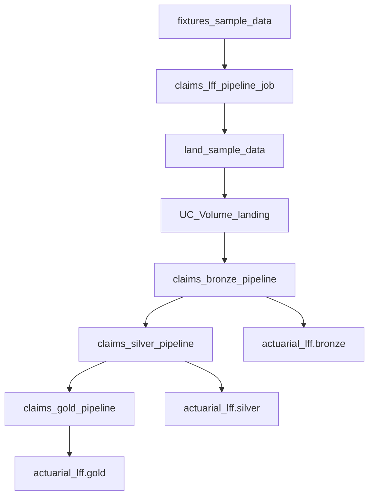

# claims_pipeline_lakeflowframework_sample

Welcome. This guide walks you through an actuarial **bronze → silver → gold** sample built with the **Lakeflow Framework**.

**In plain English:** you describe each dataset in YAML (and a bit of SQL). A shared framework runtime turns those descriptions into Lakeflow Declarative Pipeline tables in Unity Catalog. You do **not** write per-table Python `@dp.table` code here—that style lives in the sibling project [`claims_pipeline_saurabh`](../claims_pipeline_saurabh/).

Sample CSVs live under `fixtures/sample-data/` (from [`sample-data`](../sample-data/)).

If you want to **build this pipeline from scratch** step by step, use **[docs/MANUAL_BUILD_GUIDE.md](docs/MANUAL_BUILD_GUIDE.md)**. This README is for **understanding** the project by reading top to bottom.

---

## How to read this guide

Work through the sections in order. Don’t worry if terms like Auto Loader or CDF are new—we define them as we go.

1. Architecture at a glance  
2. **The parent Framework (`lakeflow_framework`) — read this first**  
3. How the flow starts  
4. Lakeflow Framework mental model (including pipeline configs)  
5. Key concepts  
6. Data lineage and landing map  
7. Bronze, silver, and gold layers (YAML, DQE, SQL, and schemas)  
8. Repository layout, datasets, and output tables  
9. Common pitfalls  
10. Steps to run the whole pipeline, then verify  

---

## Architecture at a glance

Think of this repo as **two pieces working together**:

| Piece | Role |
|-------|------|
| **`lakeflow_framework`** (parent Framework Bundle) | The **runtime**—Python package + `dlt_pipeline` notebook that reads your YAML and builds Spark Declarative Pipeline tables |
| **This sample** (a Pipeline Bundle) | The **domain config**—landing notebooks, dataflow YAML/SQL, and a job that runs bronze → silver → gold |

You’ll also hear **medallion architecture**: raw data in **bronze**, cleaned/keyed data in **silver**, business marts in **gold**.

```text
fixtures/sample-data/*.csv
        │
        ▼
 Job: claims_lff_pipeline_job
        ├── create_schemas_and_tables
        ├── land_sample_data  ──►  Volume actuarial_lff.bronze.landing
        ├── claims_bronze_pipeline
        ├── claims_silver_pipeline
        └── claims_gold_pipeline
                │
                ├── actuarial_lff.bronze.*
                ├── actuarial_lff.silver.*
                └── actuarial_lff.gold.*
```



---

## The parent Framework: `lakeflow_framework` (what students must know)

**Before you dive into this sample’s YAML, understand the parent project.**  
This sample does **not** contain the engine that builds pipelines. That engine lives in [`../lakeflow_framework`](../lakeflow_framework/) — the Databricks Solutions **Lakeflow Framework (LFF)**. In this workspace it is checked out as a **git submodule** of [databricks-solutions/lakeflow_framework](https://github.com/databricks-solutions/lakeflow_framework).

Public docs (worth bookmarking): [https://databricks-solutions.github.io/lakeflow_framework/](https://databricks-solutions.github.io/lakeflow_framework/)

### What the Framework is

In trainer terms: LFF is a **metadata-driven** way to build **Databricks Lakeflow Spark Declarative Pipelines**.

- You write **configuration** (dataflowspecs, schemas, SQL, expectations).
- The framework turns that config into real pipeline tables/views at runtime.
- It supports **batch and streaming**, across **bronze / silver / gold**, with reusable patterns (not one-off Python for every table).

You are learning a **Pipeline Bundle** that *uses* the Framework. Someone had to deploy the **Framework Bundle** into the workspace first.

### Framework Bundle vs Pipeline Bundle

| Bundle type | Example | What it contains | Deploy when |
|-------------|---------|------------------|-------------|
| **Framework Bundle** | [`lakeflow_framework`](../lakeflow_framework/) | Runtime code, `dlt_pipeline` entry notebook, default config/schemas | **First**, once per user/workspace target |
| **Pipeline Bundle** | *This sample* | Your dataflows, substitutions, jobs, volumes | **Second**, after the framework path exists |

```text
Deploy Framework Bundle  →  workspace gets .../lakeflow_framework/.../src
                                      │
                                      │  pipelines set framework.sourcePath
                                      ▼
Deploy Pipeline Bundle   →  your bronze/silver/gold pipelines call dlt_pipeline
```

If the Framework Bundle is missing, this sample’s pipelines fail looking up `dlt_pipeline`.

### What lives inside `lakeflow_framework` (student map)

You don’t need to memorize every module, but you should know these landmarks:

| Path | Why it matters |
|------|----------------|
| [`src/dlt_pipeline.ipynb`](../lakeflow_framework/src/dlt_pipeline.ipynb) | **Entry point** each pipeline attaches as a library |
| [`src/lakeflow_framework/`](../lakeflow_framework/src/lakeflow_framework/) | Canonical Python package (builder, dataflow specs, substitutions, etc.) |
| `src/local/` | Customer/local extensions (not overwritten by upgrades) |
| `samples/` | Official framework samples (separate from *this* actuarial sample) |
| `docs/` | Sphinx source for the public documentation site |

After `databricks bundle deploy -t dev` from the framework repo, the usual workspace path is:

```text
/Workspace/Users/<you>/.bundle/lakeflow_framework/dev/current/files/src
```

That folder is what this sample’s `framework_source_path` / `framework.sourcePath` must point at.

### How the entry notebook works (high level)

When bronze/silver/gold run, Databricks executes the framework notebook. Conceptually it:

1. Reads required Spark conf keys — especially **`framework.sourcePath`**, **`bundle.sourcePath`**, and **`workspace.host`**.
2. Puts the framework on `sys.path`.
3. Calls `DLTPipelineBuilder(spark, dbutils).initialize_pipeline()`.
4. The builder loads your Pipeline Bundle from `bundle.sourcePath`, applies substitutions, filters by `pipeline.dataFlowGroupFilter` / layer, and registers Declarative Pipeline datasets from your dataflowspecs.

So: **your YAML is the “what”; the parent framework is the “how.”**

### What you author vs what the Framework owns

| You author (this sample) | Framework owns |
|--------------------------|----------------|
| Dataflowspec YAML, schemas, DQE, gold/silver SQL | Interpreting specs → Spark Declarative Pipeline tables |
| `pipeline_configs/` (format + tokens) | Substitution resolution, spec loading, filters |
| Job + landing notebooks | Runtime builder (`DLTPipelineBuilder`) |
| Pipeline resource `configuration` keys | Wiring Auto Loader / CDF / SCD / MV patterns from metadata |

### Mental checklist before running this sample

1. I know **LFF = parent Framework Bundle**; this repo = **Pipeline Bundle**.  
2. I have deployed [`../lakeflow_framework`](../lakeflow_framework/) with `databricks bundle deploy -t dev`.  
3. I know my `framework_source_path` (or the default under `.bundle/lakeflow_framework/.../src`).  
4. I understand pipelines attach **`dlt_pipeline`**, not my YAML files, as the library.  
5. I can open the [Getting Started](https://databricks-solutions.github.io/lakeflow_framework/current/getting_started.html) docs if I need the official walkthrough.

With that in place, the rest of this README teaches **this actuarial Pipeline Bundle**.

---

## How the flow starts

Everything is orchestrated by one Databricks Job: **`claims_lff_pipeline_job`** (resource: [`resources/claims_pipeline_job.job.yml`](resources/claims_pipeline_job.job.yml)).

You’ll see five tasks, in order:

1. **`create_schemas_and_tables`** — Notebook on an all-purpose cluster. Ensures catalog `actuarial_lff`, schemas `bronze` / `silver` / `gold`, and the landing volume exist.
2. **`land_sample_data`** — Copies the four CSVs from the bundle into the UC Volume under folders like `claims/`, `premiums/`, and so on. Bronze will read from those folders.
3. **`bronze_pipeline`** — Serverless Lakeflow Framework pipeline (`full_refresh: true` in this job).
4. **`silver_pipeline`** — Same framework, different filter—only silver specs (`full_refresh: true`).
5. **`gold_pipeline`** — Same framework again—only gold specs (`full_refresh: true`).

**Why three pipelines?** Each pipeline is told which group of YAML specs to run via `pipeline.dataFlowGroupFilter` (`claims_bronze`, `claims_silver`, or `claims_gold`). Specs that don’t match the filter are skipped.

Each pipeline attaches the framework notebook as its library—not your YAML files directly:

```yaml
libraries:
  - notebook:
      path: ${var.framework_source_path}/dlt_pipeline
configuration:
  bundle.sourcePath: ${workspace.file_path}/src
  pipeline.dataFlowGroupFilter: claims_bronze   # or silver / gold
```

---

## Lakeflow Framework mental model

Before we open YAML, here’s the idea:

```text
Your YAML/SQL under src/dataflows/
        +
pipeline_configs (format=yaml, {bronze_schema} tokens)
        +
pipeline config: layer + dataFlowGroupFilter
        │
        ▼
Framework dlt_pipeline notebook
        │
        ▼
Lakeflow Declarative Pipeline tables in Unity Catalog
```

- You author **metadata** (what to read, how to transform, where to write).
- The framework **executes** that metadata.
- Inside a Lakeflow pipeline, Databricks owns streaming state (checkpoints / schema evolution for Auto Loader)—you don’t set those paths in these YAMLs.

**Contrast:** [`claims_pipeline_saurabh`](../claims_pipeline_saurabh/) builds the same domain with Python `@dp.table`. Same story, different authoring style.

### Pipeline configs the framework reads

The framework looks under your bundle’s `src/pipeline_configs/` and at the pipeline resource `configuration` block.

**1. Spec format** — [`src/pipeline_configs/global.json`](src/pipeline_configs/global.json)

```json
{
  "pipeline_bundle_spec_format": {
    "format": "yaml"
  }
}
```

That locks this bundle to **YAML** dataflowspecs (don’t mix JSON and YAML specs in one bundle).

**2. Substitutions** — [`src/pipeline_configs/dev_substitutions.yaml`](src/pipeline_configs/dev_substitutions.yaml)

```yaml
tokens:
  bronze_schema: actuarial_lff.bronze{logical_env}
  silver_schema: actuarial_lff.silver{logical_env}
  gold_schema: actuarial_lff.gold{logical_env}
  sample_file_location: /Volumes/actuarial_lff/bronze{logical_env}/landing
```

When a dataflowspec says `{bronze_schema}` or `{sample_file_location}`, the framework fills these in. `{logical_env}` comes from pipeline config `logicalEnv` (empty by default in this sample).

**3. Pipeline configuration keys** (see e.g. [`resources/claims_bronze_pipeline.yml`](resources/claims_bronze_pipeline.yml))

| Key | What it tells the framework |
|-----|-----------------------------|
| `bundle.sourcePath` | Where *your* `src/` lives (dataflows + pipeline_configs) |
| `framework.sourcePath` | Where the deployed framework `src/` lives |
| `workspace.host` | Workspace URL for Framework API calls |
| `bundle.target` | Bundle target (`dev` / `prod`) |
| `pipeline.layer` | Layer name (`bronze` / `silver` / `gold`) |
| `pipeline.dataFlowGroupFilter` | Only run specs with this `dataFlowGroup` |
| `logicalEnv` | Optional suffix plugged into `{logical_env}` tokens |

---

## Key concepts

You’ll meet these terms throughout the repo. Here’s the trainer version of each.

### dataflowspec

A **dataflowspec** is a YAML file under `src/dataflows/{layer}/dataflowspec/` that defines **one logical dataflow** (or a group of materialized views).

It answers: which group owns it, where data comes from, how to shape it, and where it lands. Schemas, expectations, and SQL live in sibling folders; the dataflowspec **points at them**.

### Auto Loader (`cloudFiles`)

**Auto Loader** is Databricks’ way to ingest files from a directory **incrementally**—new files are picked up without reprocessing everything by hand. Under the hood it uses Spark streaming with format `cloudFiles`.

In this framework you don’t write that Python. Bronze specs set `sourceType: cloudFiles`, a `path`, `readerOptions`, and a file schema. The framework builds the Auto Loader stream for you.

### CDF (Change Data Feed)

**CDF** is a Delta Lake feature that records **row-level changes** (inserts/updates/deletes) on a table. Downstream jobs can read “what changed” instead of re-scanning the whole table.

Bronze enables it with `delta.enableChangeDataFeed: 'true'`. Silver reads with `cdfEnabled: true`. That’s how bronze → silver stays incremental-friendly.

### SCD Type 1

**SCD Type 1** means: for a given business key, keep **one current row** and **overwrite** it when a newer change arrives (no version history in that silver table).

Silver specs use `cdcSettings` with `scd_type: '1'`, `keys`, and `sequence_by: _ingest_ts` (newest ingest wins).

### Materialized views

A **materialized view (MV)** is a table whose contents are defined by a SQL query and refreshed by the pipeline. You’ll see MVs for `claims_current` (silver) and all three gold marts.

### Data quality expectations (DQE)

**Expectations** are row-level rules the pipeline checks while writing silver. In this sample they live in YAML under `expectations/` and attach to a dataflowspec via `dataQualityExpectationsEnabled` / `dataQualityExpectationsPath`.

| Section | On failure |
|---------|------------|
| `expect_or_drop` | Row is **dropped** from the table |
| `expect` | Row is **kept**; failure is tracked in DQ metrics |

### File schema vs target schema

In bronze you’ll see pairs like `claims_bordereau_file_schema.json` and `claims_bordereau_schema.json`. They are **not** duplicates.

| Schema | Purpose |
|--------|---------|
| `*_file_schema.json` | Columns that exist **in the CSV** (what Auto Loader reads) |
| `*_schema.json` | Columns in the **Delta table**—CSV columns **plus** lineage fields `_ingest_ts` and `_source_file` |

**Why it matters:** Auto Loader must not expect `_ingest_ts` in the file. The table schema must include columns you add in `selectExp`.

Silver uses **only target schemas** (typed). There is no `*_file_schema` pair for silver—the source is already Delta, not a CSV.

---

## Data lineage

Here’s the big picture of how entities move through layers:

| Source CSV | Landing folder | Bronze table | Silver table | Used in gold |
|------------|----------------|--------------|--------------|--------------|
| `claims_bordereau.csv` | `claims/` | `claims_bordereau` | `claims_snapshots` → `claims_current` | All three marts |
| `premium_bordereau.csv` | `premiums/` | `premium_bordereau` | `policies` | Loss ratio / risk band |
| `risk_zone_lookup.csv` | `risk_zones/` | `risk_zone_lookup` | `risk_zones` | (lookup; policies carry band/region too) |
| `cyclone_events.csv` | `cyclone_events/` | `cyclone_events` | `cyclone_events` | `event_loss_summary` |

### Landing map (filename → volume subdir)

The `land_sample_data` notebook copies fixtures into the UC Volume like this:

| File | Subdir under `/Volumes/actuarial_lff/bronze/landing/` |
|------|------------------------------------------------------|
| `claims_bordereau.csv` | `claims/` |
| `premium_bordereau.csv` | `premiums/` |
| `risk_zone_lookup.csv` | `risk_zones/` |
| `cyclone_events.csv` | `cyclone_events/` |

After landing, Auto Loader paths look like `{sample_file_location}/claims/`.

**Claims path (follow this once):**

```text
claims_bordereau.csv
  → Volume .../landing/claims/
  → bronze.claims_bordereau          (Auto Loader)
  → silver.claims_snapshots          (typed SCD1 + DQ)
  → silver.claims_current            (latest snapshot per claim_id)
  → gold.event_loss_summary          (join cyclone_events)
  → gold.policy_loss_ratio / risk_band_performance  (join policies)
```

---

## Bronze layer — land the raw files

**What you’re learning:** bronze is the “as landed” layer. Keep types simple (mostly strings), add ingest lineage, enable CDF for silver.

Four dataflowspecs under [`src/dataflows/bronze/dataflowspec/`](src/dataflows/bronze/dataflowspec/), all with `dataFlowGroup: claims_bronze` and `sourceType: cloudFiles`.

| Spec | Volume subdir | Bronze table |
|------|---------------|--------------|
| `claims_bordereau_main.yaml` | `claims/` | `claims_bordereau` |
| `premium_bordereau_main.yaml` | `premiums/` | `premium_bordereau` |
| `risk_zone_lookup_main.yaml` | `risk_zones/` | `risk_zone_lookup` |
| `cyclone_events_main.yaml` | `cyclone_events/` | `cyclone_events` |

### Walkthrough: `claims_bordereau_main.yaml`

Open [`src/dataflows/bronze/dataflowspec/claims_bordereau_main.yaml`](src/dataflows/bronze/dataflowspec/claims_bordereau_main.yaml). Read it top to bottom:

1. **Identity** — `dataFlowId`, `dataFlowGroup: claims_bronze`, `dataFlowType: standard`. The group must match the bronze pipeline filter.
2. **Source** — `sourceType: cloudFiles` means Auto Loader. `path: '{sample_file_location}/claims/'` resolves to the landing volume. `readerOptions` say CSV + header + don’t infer types. `schemaPath` points at the **file** schema.
3. **Transform (`selectExp`)** — Pass through CSV columns; add `current_timestamp() AS _ingest_ts` and `_metadata.file_path AS _source_file`. `mode: stream` keeps it incremental.
4. **Target** — Write Delta to `{bronze_schema}.claims_bordereau`, turn on CDF, and use the **target** schema (includes lineage columns).

The other three bronze specs follow the same pattern with different paths and columns.

---

## Silver layer — type, key, and current claim

**What you’re learning:** silver cleans bronze into analytics-ready tables. Most tables use SCD1 over bronze CDF. One special case—`claims_current`—is a materialized view of the latest snapshot per claim.

All five specs use `dataFlowGroup: claims_silver`.

### Shared pattern (SCD1 tables)

`claims_snapshots`, `policies`, `cyclone_events`, and `risk_zones` share this shape:

```text
bronze Delta (CDF)
  → cast / type in selectExp
  → SCD Type 1 merge on keys
  → silver Delta (+ CDF for downstream)
```

Common knobs: `sourceType: delta`, `cdfEnabled: true`, `cdcSettings` with keys + `scd_type: '1'` + `sequence_by: _ingest_ts`.

### The five silver specs

| Spec | Source → target | Keys / notes |
|------|-----------------|--------------|
| [`claims_snapshots_main.yaml`](src/dataflows/silver/dataflowspec/claims_snapshots_main.yaml) | `bronze.claims_bordereau` → `silver.claims_snapshots` | Keys: `claim_id`, `snapshot_date`. Casts dates/decimals. Attaches DQE file below. |
| [`claims_current_main.yaml`](src/dataflows/silver/dataflowspec/claims_current_main.yaml) | MV over snapshots | Latest row per `claim_id` (see SQL walkthrough). |
| [`policies_main.yaml`](src/dataflows/silver/dataflowspec/policies_main.yaml) | `bronze.premium_bordereau` → `silver.policies` | Key: `policy_id`. Adds derived `is_active` from policy end date. |
| [`cyclone_events_main.yaml`](src/dataflows/silver/dataflowspec/cyclone_events_main.yaml) | `bronze.cyclone_events` → `silver.cyclone_events` | Key: `event_id`. `dataFlowId` is `silver_cyclone_events` to avoid clashing with bronze’s id. |
| [`risk_zones_main.yaml`](src/dataflows/silver/dataflowspec/risk_zones_main.yaml) | `bronze.risk_zone_lookup` → `silver.risk_zones` | Key: `postcode` (dedupes to one row per postcode). |

### Walkthrough: `claims_snapshots_dqe.yaml`

Open [`src/dataflows/silver/expectations/claims_snapshots_dqe.yaml`](src/dataflows/silver/expectations/claims_snapshots_dqe.yaml). It’s wired from the snapshots dataflowspec:

```yaml
dataQualityExpectationsEnabled: true
dataQualityExpectationsPath: ./claims_snapshots_dqe.yaml
```

| Rule | Section | Constraint | What happens |
|------|---------|------------|--------------|
| `incurred_gte_paid` | `expect_or_drop` | `incurred_amount >= paid_to_date` | Bad rows are **dropped** |
| `reported_on_or_after_loss` | `expect` | `reported_date >= date_of_loss` | Row is **kept**; failure is flagged in DQ metrics |

Both are tagged `Validity`. Only claims snapshots use DQE in this sample.

### Walkthrough: `claims_current.sql`

Open [`src/dataflows/silver/dml/claims_current.sql`](src/dataflows/silver/dml/claims_current.sql). Goal: one row per claim—the **latest** snapshot.

```sql
ROW_NUMBER() OVER (PARTITION BY claim_id ORDER BY snapshot_date DESC) AS _rn
-- ... FROM live.claims_snapshots
-- keep WHERE _rn = 1
```

1. Read `live.claims_snapshots` (table built in **this same** silver pipeline).
2. Number rows within each `claim_id`, newest `snapshot_date` first.
3. Keep `_rn = 1` and select the business columns.

**Why `live.claims_snapshots`?** Inside one pipeline, `live.` means “depend on a dataset in this run,” so the DAG can order snapshots → current. Gold **cannot** use `live.*` for silver; it reads `{silver_schema}.claims_current` by FQN because gold is a separate pipeline.

### Silver schemas (typed target layouts)

Under [`src/dataflows/silver/schemas/`](src/dataflows/silver/schemas/), four JSON files declare the **typed** Delta layout for each SCD1 table (referenced as `targetDetails.schemaPath`):

| Schema file | Silver table | Notable types |
|-------------|--------------|---------------|
| `claims_snapshots_schema.json` | `claims_snapshots` | dates + `decimal(18,2)` amounts |
| `policies_schema.json` | `policies` | decimals, dates, **`is_active` boolean** (derived; not in bronze) |
| `cyclone_events_schema.json` | `cyclone_events` | `start_date` / `end_date` as date |
| `risk_zones_schema.json` | `risk_zones` | postcode / region / wind band strings |

Compared with bronze:

- Silver schemas are **typed** (dates, decimals, boolean)—not all strings.
- There is **no** `*_file_schema.json` pair (source is Delta).
- `_ingest_ts` is kept (SCD sequencing); bronze’s `_source_file` is dropped in `selectExp`.
- `claims_current` has no separate schema JSON—its shape comes from the MV SQL.

---

## Gold layer — actuarial marts

**What you’re learning:** gold answers business questions with SQL materialized views over silver. One dataflowspec registers all three marts.

Open [`src/dataflows/gold/dataflowspec/gold_marts_main.yaml`](src/dataflows/gold/dataflowspec/gold_marts_main.yaml):

- `dataFlowGroup: claims_gold`
- `dataFlowType: materialized_view`
- Under `materializedViews`, each key becomes a table name; `sqlPath` points at SQL under [`src/dataflows/gold/dml/`](src/dataflows/gold/dml/); `database: '{gold_schema}'` publishes into `actuarial_lff.gold`

| Mart | What it answers | Main inputs |
|------|-----------------|-------------|
| `event_loss_summary` | Claim counts and losses **by cyclone event** | `claims_current` ⋈ `cyclone_events` |
| `policy_loss_ratio` | Premium vs incurred by **insurer / wind risk / building type** | `policies` + claim rollups |
| `risk_band_performance` | Claim frequency and loss ratio by **wind risk / region** | same, different grouping |

**Why `{silver_schema}.claims_current` instead of `live.*`?** Gold runs as a separate pipeline from silver. Cross-pipeline reads use fully qualified names (tokens resolve to e.g. `actuarial_lff.silver.claims_current`).

Unlike bronze, there is no Auto Loader path, `selectExp`, or SCD block here—just “run this SQL → refresh this MV.”

### Walkthrough: the three gold SQL files

**1. [`event_loss_summary.sql`](src/dataflows/gold/dml/event_loss_summary.sql)** — losses by cyclone

- `INNER JOIN` `{silver_schema}.claims_current` to `{silver_schema}.cyclone_events` on `event_id` (only claims tied to a known event).
- Grain: one row per event.
- Metrics: distinct claim count, total incurred/paid, Open / Closed / Reopened counts.
- Uses `claims_current` so each claim counts once (not every historical snapshot).

**2. [`policy_loss_ratio.sql`](src/dataflows/gold/dml/policy_loss_ratio.sql)** — premium vs loss by segment

- CTE `claims_by_policy` rolls current claims up to `policy_id`.
- `LEFT JOIN` from `{silver_schema}.policies` so policies with no claims still appear (`COALESCE` → zeros).
- Grain: `insurer_name` × `wind_risk_band` × `building_type`.
- Key KPI: `loss_ratio = total_incurred / total_premium` (null if premium is 0).

**3. [`risk_band_performance.sql`](src/dataflows/gold/dml/risk_band_performance.sql)** — performance by risk geography

- Same CTE + left-join-from-policies pattern.
- Grain: `wind_risk_band` × `region_name`.
- KPIs: `claim_frequency = claim_count / policy_count`, plus the same `loss_ratio`.

```text
silver.claims_current ──┬──► event_loss_summary  (+ cyclone_events)
                        │
silver.policies ────────┴──► policy_loss_ratio
                             risk_band_performance
```

---

## Repository layout

```text
claims_pipeline_lakeflowframework_sample/
├── databricks.yml                 # Bundle variables and targets
├── fixtures/sample-data/          # Sample CSVs to land
├── resources/
│   ├── landing.volume.yml         # UC Volume for landing files
│   ├── claims_bronze_pipeline.yml # Serverless bronze pipeline
│   ├── claims_silver_pipeline.yml
│   ├── claims_gold_pipeline.yml
│   └── claims_pipeline_job.job.yml
└── src/
    ├── notebooks/                 # Create schemas + land CSVs
    ├── pipeline_configs/          # Spec format + {token} substitutions
    └── dataflows/
        ├── bronze/{dataflowspec,schemas}/
        ├── silver/{dataflowspec,schemas,expectations,dml}/
        └── gold/{dataflowspec,dml}/
```

---

## Source datasets

| File | Grain / notes | Join keys |
|------|----------------|-----------|
| `claims_bordereau.csv` | SCD-style claim snapshots (`claim_id` + `snapshot_date`) | `policy_id`, `event_id` |
| `premium_bordereau.csv` | One row per policy (~5,000) | `policy_id`, `postcode` |
| `risk_zone_lookup.csv` | Postcode → region / wind risk band | `postcode` |
| `cyclone_events.csv` | Six illustrative cyclone events | `event_id` |

## Output tables

| Layer | Schema | Tables |
|-------|--------|--------|
| Bronze | `actuarial_lff.bronze` | `claims_bordereau`, `premium_bordereau`, `risk_zone_lookup`, `cyclone_events` |
| Silver | `actuarial_lff.silver` | `claims_snapshots`, `claims_current`, `policies`, `risk_zones`, `cyclone_events` |
| Gold | `actuarial_lff.gold` | `event_loss_summary`, `policy_loss_ratio`, `risk_band_performance` |

---

## Common pitfalls

Before you run anything, watch for these (they catch most first-time failures):

1. **Framework not deployed** — pipeline library path 404s. Deploy `lakeflow_framework` first.
2. **Catalog/schema missing at deploy** — the landing volume resource needs `actuarial_lff.bronze` to exist **before** `bundle deploy` of this sample.
3. **Wrong `dataFlowGroupFilter`** — specs are silently skipped. Group names must match (`claims_bronze` / `claims_silver` / `claims_gold`).
4. **`live.` vs FQN** — use `live.` only for tables in the **same** pipeline; gold reads silver via `{silver_schema}.…`.
5. **File vs target schema** — Auto Loader’s file schema must not require `_ingest_ts` / `_source_file` from the CSV.

---

## Prerequisites

1. Databricks CLI authenticated to `https://adb-7405611775215693.13.azuredatabricks.net`.
2. Unity Catalog rights to create catalog `actuarial_lff` (or have an admin create it) with schemas `bronze`, `silver`, `gold`, and grants for `CREATE_TABLE` / `CREATE_MATERIALIZED_VIEW` / `CREATE_VOLUME`.
3. All-purpose cluster `0730-111218-jwuz715u` startable for setup/land notebook tasks.
4. Ability to deploy the separate `lakeflow_framework` bundle (pipelines attach its `dlt_pipeline` notebook).

For a full from-scratch build of every file, see **[docs/MANUAL_BUILD_GUIDE.md](docs/MANUAL_BUILD_GUIDE.md)**.

---

## Steps to run the whole pipeline

Follow these in order. The goal is one successful job run that lands CSVs and refreshes bronze → silver → gold.

### Step 1 — Deploy the Lakeflow Framework

Pipelines in this sample attach `${framework_source_path}/dlt_pipeline`. That notebook must already exist in the workspace:

```bash
cd ../lakeflow_framework
databricks bundle deploy -t dev
```

Default path (dev):  
`/Workspace/Users/<you>/.bundle/lakeflow_framework/dev/current/files/src`

### Step 2 — Bootstrap catalog / schemas (before this sample’s deploy)

The landing **volume** resource needs `actuarial_lff.bronze` to exist when you deploy this bundle. Create catalog/schemas once if needed:

```sql
CREATE CATALOG IF NOT EXISTS actuarial_lff;
CREATE SCHEMA IF NOT EXISTS actuarial_lff.bronze;
CREATE SCHEMA IF NOT EXISTS actuarial_lff.silver;
CREATE SCHEMA IF NOT EXISTS actuarial_lff.gold;
```

(The job’s `create_schemas_and_tables` notebook also ensures these—and the volume—exist at **run** time, but `bundle deploy` still needs the schema for the volume resource.)

### Step 3 — Validate and deploy this sample

```bash
cd ../claims_pipeline_lakeflowframework_sample

databricks bundle validate --target dev
databricks bundle deploy --target dev
```

If your framework path differs from the default, override it:

```bash
databricks bundle deploy -t dev \
  --var="framework_source_path=/Workspace/Users/<user>/.bundle/lakeflow_framework/dev/current/files/src"
```

### Step 4 — Run the full job (recommended)

This runs the whole chain: create schemas → land CSVs → bronze → silver → gold.

```bash
databricks bundle run claims_pipeline_job
```

What the job does (see [`resources/claims_pipeline_job.job.yml`](resources/claims_pipeline_job.job.yml)):

| Task | Action |
|------|--------|
| `create_schemas_and_tables` | Notebook: catalog / schemas / volume |
| `land_sample_data` | Notebook: copy fixtures into the landing volume |
| `bronze_pipeline` | Framework pipeline, `full_refresh: true` |
| `silver_pipeline` | Framework pipeline, `full_refresh: true` |
| `gold_pipeline` | Framework pipeline, `full_refresh: true` |

`full_refresh: true` rebuilds pipeline datasets from scratch on each job run (fine for this sample; useful when you re-land the same demo files).

### Step 5 — Optional: run a single pipeline

If data is already landed and you only need to refresh one layer:

```bash
databricks bundle run claims_bronze_pipeline
databricks bundle run claims_silver_pipeline
databricks bundle run claims_gold_pipeline
```

Run them in order (bronze → silver → gold) if you refresh more than one.

### Step 6 — Verify

Use the checks in the next section.

---

## Verify data

| Check | Expected |
|-------|----------|
| Bronze / silver claim snapshots | ~2,829 |
| `actuarial_lff.silver.claims_current` | ~1,533 unique claims |
| `actuarial_lff.silver.policies` | 5,000 |
| `actuarial_lff.silver.risk_zones` | 19 (one postcode deduped) |
| `actuarial_lff.silver.cyclone_events` | 6 |
| `actuarial_lff.gold.event_loss_summary` | 6 |

```sql
SELECT 'bronze_claims' AS t, COUNT(*) AS n FROM actuarial_lff.bronze.claims_bordereau
UNION ALL SELECT 'silver_snapshots', COUNT(*) FROM actuarial_lff.silver.claims_snapshots
UNION ALL SELECT 'silver_current', COUNT(*) FROM actuarial_lff.silver.claims_current
UNION ALL SELECT 'silver_policies', COUNT(*) FROM actuarial_lff.silver.policies
UNION ALL SELECT 'gold_event_loss', COUNT(*) FROM actuarial_lff.gold.event_loss_summary;

SELECT * FROM actuarial_lff.gold.event_loss_summary ORDER BY total_incurred DESC;
```

Landing files (optional sanity check):

```sql
LIST '/Volumes/actuarial_lff/bronze/landing/claims';
```

---

## Related repos

| Path | Role |
|------|------|
| [`../lakeflow_framework`](../lakeflow_framework/) | **Parent Framework Bundle** (LFF submodule) — `dlt_pipeline` + runtime; deploy first. Docs: [lakeflow_framework](https://databricks-solutions.github.io/lakeflow_framework/) |
| [`../claims_pipeline_saurabh`](../claims_pipeline_saurabh/) | Same domain model using Python declarative pipelines |
| [`../sample-data`](../sample-data/) | Upstream sample CSVs |
| [`../deploy-databricks-azure`](../deploy-databricks-azure/) | Workspace / cluster provisioning |
