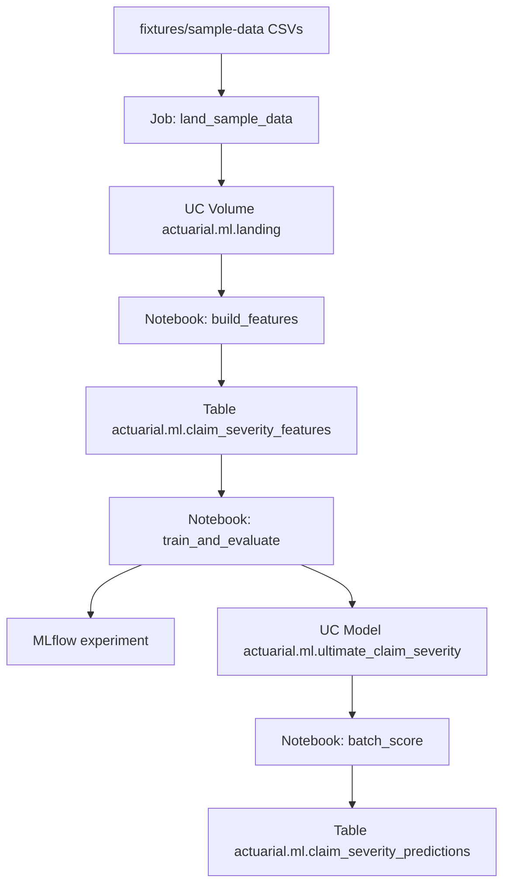

# Early Claim Severity ML Demo — Training Guide

**Project:** `ml-pipeline-demo`  
**Audience:** Analysts and engineers who know insurance claims data but may be new to Databricks ML  
**Style:** Trainer-led walkthrough — read in order, pause at each checkpoint

---

## 0. Welcome and learning path

### What you will build

You will run a small but complete machine learning pipeline on Databricks:

1. Land sample cyclone/insurance CSVs into Unity Catalog  
2. Build a **training table** that answers: *“At first report, what do we know?”*  
3. Train a model that predicts the **ultimate closed claim cost**  
4. Track the run in **MLflow** and register the model in **Unity Catalog**  
5. Batch-score predictions into a table you can query

By the end you should be able to explain **what each notebook does**, **why we use two clusters**, and **how we avoid leaking future claim information into the model**.

### Learning outcomes

After this lab you can:

- Tell the business story of early severity prediction in plain English  
- Point to first vs ultimate claim snapshots in the sample data  
- Explain data leakage with a wrong vs right feature example  
- Deploy and run the Databricks Asset Bundle job end to end  
- Find the experiment, the UC model, and the predictions table in the UI  

### Suggested reading order

1. Business story (§1) + data tour (§2)  
2. Big picture (§3) + compute primer (§4)  
3. Bundle contract (§5)  
4. Labs A–E (§6–§10) while looking at the notebooks  
5. Full job run (§11) + live demo script (§12)  
6. Glossary + self-check (§13)  

### Map of key files

| File | Role |
|------|------|
| [`../databricks.yml`](../databricks.yml) | Bundle identity, variables, workspace targets |
| [`../resources/ml_schema.yml`](../resources/ml_schema.yml) | UC schema `actuarial.ml` |
| [`../resources/landing.volume.yml`](../resources/landing.volume.yml) | UC Volume `landing` |
| [`../resources/ml_pipeline_job.job.yml`](../resources/ml_pipeline_job.job.yml) | Job: setup → land → features → train → score |
| [`../src/00_setup.ipynb`](../src/00_setup.ipynb) | Schema + grants |
| [`../src/01_land_sample_data.ipynb`](../src/01_land_sample_data.ipynb) | Copy fixtures into the volume |
| [`../src/02_build_features.ipynb`](../src/02_build_features.ipynb) | Leakage-safe feature table |
| [`../src/03_train_and_evaluate.ipynb`](../src/03_train_and_evaluate.ipynb) | Train, MLflow, register model |
| [`../src/04_batch_score.ipynb`](../src/04_batch_score.ipynb) | Score and write predictions |
| [`../src/ml_pipeline_demo/features.py`](../src/ml_pipeline_demo/features.py) | Shared feature logic (unit-tested) |
| [`../README.md`](../README.md) | Short deploy / run / verify reference |

**Checkpoint:** The README is the ops cheat sheet. This guide is the teaching path. Keep both open.

---

## 1. Business story

### The problem in one sentence

When a claim is first reported, the first cost estimate is often **too low**. We want an earlier, smarter guess of what the claim will ultimately cost when it closes.

### Who cares

| Role | Why it helps |
|------|----------------|
| Claims handler | Flags likely large losses for senior review sooner |
| Actuarial / reserving | Better early reserve hint (demo-sized, not a production reserving system) |
| Portfolio lead | Sees which perils / regions drive under-estimation at first notice |

### What “success” means here

We are **not** trying to build a production pricing engine. Success for this demo means:

1. The model uses **only information available at first report**  
2. We can show metrics (how wrong we are on average) in MLflow  
3. We can show a table: first estimate vs **model prediction** vs **actual ultimate**  
4. The model is saved in Unity Catalog so others can find it  

**Checkpoint:** In your own words, finish this sentence: *“At first notice of loss, we predict ___ so that ___.”*

---

## 2. Data tour

Sample files live in [`../fixtures/sample-data/`](../fixtures/sample-data/) (copied from repo [`sample-data`](../../sample-data/)).

| File | Grain | Join keys | Role in this demo |
|------|--------|-----------|-------------------|
| `claims_bordereau.csv` | Claim **snapshots** over time (`claim_id` + `snapshot_date`) | `policy_id`, `event_id` | First vs ultimate incurred |
| `premium_bordereau.csv` | One row per policy (~5,000) | `policy_id` | Risk features (band, building, sum insured, mitigation, region) |
| `cyclone_events.csv` | Event calendar | `event_id` | Context only (not required for v1 features) |
| `risk_zone_lookup.csv` | Postcode → band | `postcode` | Context only (policy already carries band/region) |

### Worked example — claim development

Take claim `CLM-000001` from the sample (simplified):

| When | Status | Incurred |
|------|--------|----------|
| First snapshot (2025-02-17) | Open | **$52,550** |
| Later snapshot (2025-03-13) | Closed | **$111,474** |

Ultimate is about **2.1×** the first estimate. That pattern is common in this dataset (median uplift ~2.2×).  
Our model’s job: given the first row + policy facts, guess a number closer to the closed amount.

**Checkpoint:** Open `claims_bordereau.csv` and find two rows for the same `claim_id` with different `snapshot_date`. Which row is “first report”? Which is “ultimate” for training?

---

## 3. Big picture



### Where things live in Unity Catalog

| Object | Prod (`-t prod`) | Dev (`-t dev`, prefixed) |
|--------|------------------|--------------------------|
| Schema | `actuarial.ml` | `actuarial.dev_<user>_ml` (e.g. `dev_databricks_np_ml`) |
| Landing volume | `/Volumes/actuarial/ml/landing` | `/Volumes/actuarial/dev_<user>_ml/landing` |
| Feature table | `…claim_severity_features` | same table name under the prefixed schema |
| Registered model | `…ultimate_claim_severity` | same |
| Predictions | `…claim_severity_predictions` | same |
| MLflow experiment | `/Shared/ml-pipeline-demo/ultimate_claim_severity` | same |

The job parameters resolve the **deployed** schema name automatically via `${resources.schemas.actuarial_ml.name}`.

**Checkpoint:** Draw the flow on a whiteboard without looking. Then compare to the diagram.

---

## 4. Compute primer — why two clusters?

| Workload | Cluster | Access mode | Why |
|----------|---------|-------------|-----|
| Setup, land, features | Shared all-purpose (`cluster_id`) | Shared / `USER_ISOLATION` | Fine for file copy + SQL/pandas feature build; matches other demo jobs |
| Train, register, score | **Dedicated ML Runtime** (`ml_cluster_id`) | **Dedicated** (single user) | ML Runtime ships sklearn/MLflow; Models in Unity Catalog need Dedicated access for this workload |

### Create the Dedicated ML cluster (UI steps)

1. In Databricks, open **Compute** → **Create compute**.  
2. Name it something like `yourname-ml-demo`.  
3. Databricks Runtime: pick a recent **ML** LTS (name contains `ml`).  
4. Access mode: **Dedicated** → select **you**.  
5. Single node is enough for this demo (saves quota/cost).  
6. Auto-termination: 30 minutes.  
7. Create → copy the **Cluster ID** into [`../databricks.yml`](../databricks.yml) as `ml_cluster_id`.

**Common mistake:** Training on the Shared ETL cluster. File copy works; UC model registration for classic ML often fails or is unsupported in Shared mode. Use the ML cluster for notebooks `03` and `04`.

**Checkpoint:** Confirm `ml_cluster_id` in `databricks.yml` is no longer `REPLACE_WITH_DEDICATED_ML_CLUSTER_ID`.

---

## 5. Bundle contract (`databricks.yml`)

A **Databricks Asset Bundle** is a project folder that declares what to deploy (jobs, volumes, schemas) and to which workspace.

Important variables:

| Variable | Meaning |
|----------|---------|
| `catalog` | Usually `actuarial` |
| `schema` | `ml` — keeps ML objects separate from bronze/silver/gold |
| `cluster_id` | Shared cluster for setup / land / features |
| `ml_cluster_id` | Dedicated ML cluster for train / score |
| `landing_volume_path` | `/Volumes/actuarial/ml/landing` |

Targets:

- **`dev`** (default) — development mode; resources get a `[dev username]` prefix in the workspace  
- **`prod`** — production root path + `CAN_MANAGE` for the project owner  

You do **not** need to memorize every YAML key. Remember: **`databricks.yml` points at resources; the job YAML lists notebook tasks in order.**

**Checkpoint:** Open [`../resources/ml_pipeline_job.job.yml`](../resources/ml_pipeline_job.job.yml) and list the five `task_key` values in order.

---

## 6. Lab A — Setup (`00_setup.ipynb`)

### Idea

Make sure Unity Catalog has a home for the demo: schema `actuarial.ml`, and grants so we can create tables and **models**.

### What the notebook does

- `CREATE SCHEMA IF NOT EXISTS actuarial.ml`  
- Best-effort `GRANT` including **`CREATE MODEL`** on the schema  

The landing **volume** is also declared in bundle YAML (`landing.volume.yml`) and is created on deploy.

### Checkpoint

After setup (or after a full job run):

```sql
SHOW SCHEMAS IN actuarial;
-- expect: ml

SHOW VOLUMES IN actuarial.ml;
-- expect: landing
```

---

## 7. Lab B — Land data (`01_land_sample_data.ipynb`)

### Idea

The job copies CSVs from the **deployed bundle folder** into the Volume so later steps always read from a stable UC path.

### Layout after landing

```text
/Volumes/actuarial/ml/landing/
  claims/claims_bordereau.csv
  premiums/premium_bordereau.csv
  risk_zones/risk_zone_lookup.csv
  cyclone_events/cyclone_events.csv
```

### Checkpoint

```sql
LIST '/Volumes/actuarial/ml/landing/claims';
LIST '/Volumes/actuarial/ml/landing/premiums';
```

You should see the CSV filenames. If land fails with “source not found”, the job parameter `source_path` did not resolve — redeploy the bundle and run again from the job (not a random local path).

---

## 8. Lab C — Features (`02_build_features.ipynb`)

### Idea

Turn messy snapshot history into **one clean row per closed claim** for training.

Logic lives in [`../src/ml_pipeline_demo/features.py`](../src/ml_pipeline_demo/features.py) so we can unit-test it locally.

### Recipe

For each `claim_id`:

1. Find the **latest** snapshot. Keep the claim only if status is `Closed` and incurred is numeric.  
2. That latest incurred → target `ultimate_incurred`.  
3. Find the **earliest** snapshot → `first_incurred`, `peril_type`, `report_lag_days`.  
4. Join policy attributes on `policy_id`.  
5. Drop rows with missing keys.

### Leakage — wrong vs right

| Wrong (do not do) | Right (what we do) |
|-------------------|--------------------|
| Use final `paid_to_date` as a feature | Ignore later payments for predictors |
| Use average of all snapshot incurred | Use **first** snapshot incurred only |
| Train on still-Open claims with “ultimate = current” | Train only on claims that actually **Closed** |

If you leak the answer, metrics look amazing in the demo and fail in real life.

### Checkpoint

```sql
SELECT COUNT(*) AS n FROM actuarial.ml.claim_severity_features;
-- expect about 1156

SELECT claim_id, first_incurred, ultimate_incurred,
       round(ultimate_incurred / first_incurred, 2) AS uplift
FROM actuarial.ml.claim_severity_features
ORDER BY uplift DESC
LIMIT 10;
```

Locally you can also run:

```bash
cd ml-pipeline-demo && pytest -q
```

---

## 9. Lab D — Train and evaluate (`03_train_and_evaluate.ipynb`)

### Idea

Ask the computer: *given these first-report features, what ultimate cost do you expect?*

We use a simple **Random Forest** regressor inside a sklearn **Pipeline** (one-hot encode categories, then forest). You do not need to tune hyperparameters for this lab.

### Words for the metrics

| Metric | Plain English |
|--------|----------------|
| **MAE** | On average, how many dollars we are off (absolute) |
| **RMSE** | Like MAE but punishes big misses more |
| **R²** | How much of the variation we explain (1.0 = perfect, 0 ≈ guessing the mean) |

### MLflow

**MLflow** is the lab notebook for experiments: each train run stores parameters, metrics, and the model file.  
We also **register** the model into Unity Catalog so it appears next to your tables.

### Live demo moment

The notebook prints a small table: `first_incurred` vs `predicted_ultimate` vs `ultimate_incurred` for holdout claims. Use that slide in your talk.

### Checkpoint

1. Open **Experiments** → `/Shared/ml-pipeline-demo/ultimate_claim_severity`.  
2. Open the latest run → confirm MAE / RMSE / R².  
3. Catalog Explorer → `actuarial.ml` → Models → `ultimate_claim_severity`.

---

## 10. Lab E — Register and batch score (`04_batch_score.ipynb`)

### Idea

Loading a registered model and writing predictions is the “ops” half of ML: train once, score many rows.

This notebook:

1. Loads `actuarial.ml.ultimate_claim_severity` (sets a `Champion` alias when possible)  
2. Scores every row in `claim_severity_features`  
3. Writes `actuarial.ml.claim_severity_predictions` with `predicted_ultimate` and `uplift_vs_first`

### How to talk about results

Sort by `uplift_vs_first` descending. Those are claims where the model thinks the ultimate will be **much larger** than the first estimate — a simple triage list for the demo narrative.

### Checkpoint

```sql
SELECT claim_id, first_incurred, predicted_ultimate, ultimate_incurred,
       round(uplift_vs_first, 2) AS uplift
FROM actuarial.ml.claim_severity_predictions
ORDER BY uplift_vs_first DESC
LIMIT 20;
```

---

## 11. Run the full job

### Steps

```bash
cd ml-pipeline-demo

# 1) Put your Dedicated ML cluster ID into databricks.yml → ml_cluster_id

databricks bundle validate -t dev
databricks bundle deploy -t dev

# 2) In the UI, start Shared cluster + ML cluster

databricks bundle run ml_pipeline_job -t dev
```

### Task order

1. `setup`  
2. `land_sample_data`  
3. `build_features`  
4. `train_and_evaluate`  
5. `batch_score`  

### If something fails

| Task | Typical cause |
|------|----------------|
| `setup` | No rights on catalog `actuarial` |
| `land_sample_data` | Cluster stopped; or bundle not deployed (missing fixtures path) |
| `build_features` | Landing empty; or `project_src` not on `sys.path` |
| `train_and_evaluate` | `ml_cluster_id` still placeholder; cluster not ML / not Dedicated; missing `CREATE MODEL` |
| `batch_score` | Train never registered a model version |

**Checkpoint:** Job run shows five green tasks. Then run the verify SQL from the README.

---

## 12. Live demo script (10–15 minutes)

Use this as a facilitator outline.

| Minute | Say / do |
|--------|----------|
| 0–1 | “We predict ultimate claim cost at first report so claims can triage large losses earlier.” |
| 1–3 | Show `CLM-000001` two snapshots (~2× development). |
| 3–5 | Diagram: land → features → train → UC model → predictions. Mention two clusters in one sentence. |
| 5–7 | Open `claim_severity_features` — one row per closed claim; point at `first_incurred` vs `ultimate_incurred`. |
| 7–10 | Open MLflow experiment — MAE/RMSE/R²; open model artifact. |
| 10–12 | Catalog Explorer → registered model. |
| 12–15 | Query predictions ordered by `uplift_vs_first`; pick one row and narrate triage. |

Optional closer: “This is demo-sized ML on the same sample data as our medallion pipelines — next steps could be Model Serving or time-based validation.”

---

## 13. Glossary + self-check

### Glossary

| Term | Simple meaning |
|------|----------------|
| **Ultimate incurred** | Best estimate of total claim cost when the claim is closed (here: closed snapshot incurred) |
| **First report / first snapshot** | Earliest row for a claim in the bordereau |
| **Feature** | An input the model is allowed to see |
| **Target / label** | The answer we train toward (`ultimate_incurred`) |
| **Leakage** | Accidentally giving the model future information |
| **MLflow** | Tool that records experiment runs and model files |
| **Unity Catalog model** | A registered model governed like a table (name, permissions, versions) |
| **Dedicated cluster** | Compute assigned to one user (or group); required here for UC ML training |
| **Batch score** | Run the model on many rows at once and write a table |
| **Bundle (DAB)** | Project that deploys Databricks jobs/resources as code |

### Self-check (try before peeking)

1. Why do we train only on **Closed** claims?  
2. Name three policy features we join in.  
3. What is wrong with using final `paid_to_date` as a feature?  
4. Which cluster runs `01_land_sample_data`? Which runs `03_train_and_evaluate`?  
5. Where do experiment metrics appear in the UI?  
6. What UC three-level name does the registered model use?  
7. About how many rows should `claim_severity_features` have?  
8. What does a high `uplift_vs_first` suggest for triage?  
9. Which file contains the unit-tested feature logic?  
10. What must you replace in `databricks.yml` before the job can train?

### Answers

1. We need a known ultimate (label). Open claims do not have a final answer yet.  
2. Any three of: `wind_risk_band`, `building_type`, `sum_insured`, `mitigation_flag`, `region_name`.  
3. Final paid is only known later — leakage; the model would “cheat.”  
4. Shared `cluster_id`; Dedicated `ml_cluster_id`.  
5. Experiments → `/Shared/ml-pipeline-demo/ultimate_claim_severity`.  
6. `actuarial.ml.ultimate_claim_severity`.  
7. About **1,156** (order of 1.1k).  
8. Model expects ultimate much larger than first estimate — review sooner.  
9. `src/ml_pipeline_demo/features.py`.  
10. `ml_cluster_id` (Dedicated ML Runtime cluster ID).

---

## Next steps (optional, out of scope for this bundle)

- Time-based train/test split by `date_of_loss`  
- High-severity classifier (ultimate ≥ $250k) alongside regression  
- Model Serving endpoint for online scoring  
- Optional Terraform for the ML cluster in `deploy-databricks-azure`

You have finished the trainer path. For day-to-day commands, return to the [`README`](../README.md).
